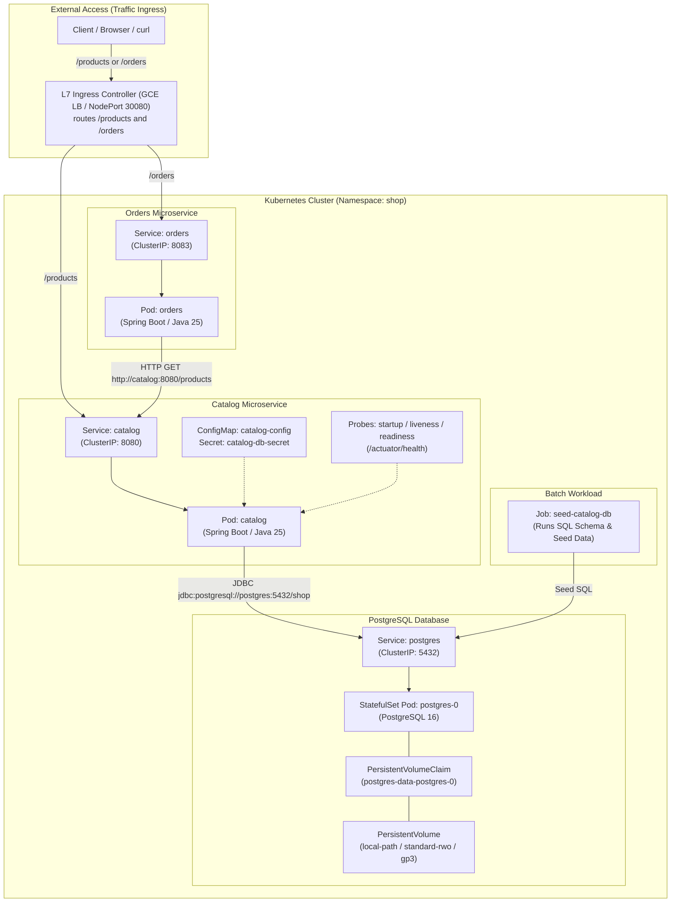
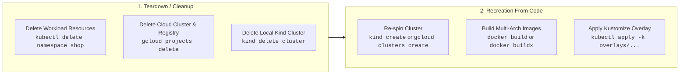

# Kubernetes Learning Journey

> **Learn by doing, understand by observing.**  
> A structured, hands-on engineering journey from zero to running a production-grade multi-service system on Kubernetes — locally with `kind`, on Google Cloud with **GKE Autopilot**, and on Amazon Web Services with **EKS**.

---

## What This Project Is

This is an architectural and operational learning project. We build and deploy three interconnected services (`catalog`, `orders`, `postgres`) and deliberately touch every foundational Kubernetes abstraction along the way.

Rather than treating Kubernetes as a black-box deployment target, this journey exposes the underlying platform mechanics: pod lifecycle states, container networking, cluster DNS, persistent storage guarantees, health probing, zero-downtime rolling upgrades, multi-cloud Kustomize overlays, L7 Ingress routing, and GitOps CI/CD delivery pipelines.

* **Full Architecture & Decisions:** [`docs/DESIGN.md`](docs/DESIGN.md)
* **Technical Specifications & Requirements:** [`docs/SPEC-kubernetes-learning.md`](docs/SPEC-kubernetes-learning.md)
* **Living Learning Glossary & Deep Dives:** [`docs/CONCEPTS.md`](docs/CONCEPTS.md)
* **Progress Tracking & Task Backlog:** [`tasks/todo.md`](tasks/todo.md)

---

## System Architecture



---

## Learning Philosophy

> 🤚 **You run the cluster. The agent writes the code.**

This repository splits responsibility deliberately:

| Who | Does What |
|-----|-----------|
| 🤖 **Agent** | Scaffolds applications, writes Dockerfiles, authors YAML manifests, configures Kustomize overlays, and writes detailed step-by-step playbooks |
| 🤚 **You** | Executes every `docker`, `kubectl`, `kind`, `gcloud`, and `aws` command in your local shell |

**Why this model?** Learning Kubernetes requires direct sensory observation of state transitions. A manifest that works is interesting; watching DNS resolve an internal service, witnessing a Pod self-heal after manual deletion, seeing how a `startupProbe` handles a JVM cold start, and observing a StatefulSet retain volume claims across pod eviction is what builds true architectural mastery.

Every manual step in the playbooks includes a **"🤚 What to Observe"** section.

---

## Prerequisites & Tooling

Install the following tools before beginning:

| Tool | Min Version | Installation | Purpose |
|------|------------|--------------|---------|
| **Docker Desktop** | 4.x+ | [docker.com/get-started](https://www.docker.com/get-started/) | Container engine and local runtime |
| **`kind`** | 0.24+ | `brew install kind` | Kubernetes in Docker (local cluster) |
| **`kubectl`** | 1.31+ | `brew install kubectl` | Cluster CLI & control plane interaction |
| **Java** | 25 LTS | `sdk install java 25-open` via [sdkman.io](https://sdkman.io/) | Application runtime (Spring Boot 4.x) |
| **Maven** | 3.9+ | `brew install maven` or bundled `./mvnw` | Application builds & packaging |
| **`gcloud` CLI** | latest | [cloud.google.com/sdk](https://cloud.google.com/sdk/docs/install) | Google Cloud provisioning (Playbook 07) |
| **`gke-gcloud-auth-plugin`** | latest | `gcloud components install gke-gcloud-auth-plugin` | Mandatory authentication for GKE |
| **`aws` CLI / `eksctl`** | v2+ / latest | [docs.aws.amazon.com](https://docs.aws.amazon.com/cli/) | AWS EKS provisioning (Phase 5 / Playbook 08) |

Verify your local environment:

```bash
docker --version && kind --version && kubectl version --client && java -version && mvn -version
```

---

## Quick Start (Local `kind`)

### Option A: Complete Local Deployment via Kustomize (One-Shot)

If you already have Docker running and want to deploy the complete working system locally:

```bash
# 1. Create the kind cluster with port-mapping (30080 -> 80)
kind create cluster --name k8s-learn --config kind/cluster-config.yaml
kubectl cluster-info --context kind-k8s-learn

# 2. Build application container images
docker build -t shop/catalog:dev apps/catalog/
docker build -t shop/orders:dev apps/orders/

# 3. Load images into kind's internal container runtime
kind load docker-image shop/catalog:dev --name k8s-learn
kind load docker-image shop/orders:dev --name k8s-learn

# 4. Deploy the complete system using the kind Kustomize overlay
kubectl apply -k k8s/overlays/kind/

# 5. Seed the database (runs run-to-completion batch Job)
kubectl apply -f k8s/base/06-seed-job.yaml -n shop
kubectl wait --for=condition=complete --timeout=60s job/seed-catalog-db -n shop

# 6. Verify all pods are running and ready
kubectl get pods -n shop
```

Verify service responses:

```bash
# Verify Catalog directly (via NodePort)
curl http://localhost:30080/products

# Verify Orders microservice (via port-forward, tests orders -> catalog -> postgres)
kubectl port-forward svc/orders 8083:8083 -n shop &
curl http://localhost:8083/orders
```

---

### Option B: Guided Learning Journey (Recommended)

To understand every layer from first principles, follow the step-by-step playbooks in the [`playbooks/`](playbooks/) directory:

1. Start with [Playbook 00: Containerize](playbooks/00-containerize.md) to package applications and spin up `kind`.
2. Progress sequentially through Playbooks 01 to 07.
3. Observe state transitions and document your takeaways in [`docs/CONCEPTS.md`](docs/CONCEPTS.md).

---

## Google Cloud GKE Autopilot Integration

Deploying to **GKE Autopilot** demonstrates that declarative Kubernetes manifests and Kustomize overlays remain truly portable from your laptop to the cloud.

### Key GKE Autopilot Concepts
* **Serverless Node Management:** You declare Pod `resources.requests` and GKE Autopilot provisions, scales, and manages the underlying compute nodes dynamically.
* **StorageClass Transition:** While `kind` uses `rancher.io/local-path`, GKE Autopilot automatically provisions Google Compute Engine persistent disks via the `standard-rwo` CSI driver (`pd.csi.storage.gke.io`).
* **Artifact Registry:** Images are pushed to Google Artifact Registry and pulled by GKE nodes without credential overhead via GCP internal networking.

### End-to-End GKE Deployment Workflow

```bash
# 1. Authenticate gcloud and set project variables
gcloud auth login
gcloud auth application-default login
export PROJECT_ID="k8s-learn-$(whoami | tr '[:upper:]' '[:lower:]')"
export REGION="us-central1"

# 2. Create isolated GCP Project & link billing
gcloud projects create $PROJECT_ID --name="k8s-learn"
gcloud config set project $PROJECT_ID
export BILLING_ACCOUNT=$(gcloud beta billing accounts list --format="value(name)" --limit=1)
gcloud beta billing projects link $PROJECT_ID --billing-account=$BILLING_ACCOUNT

# 3. Enable GKE and Artifact Registry APIs
gcloud services enable container.googleapis.com artifactregistry.googleapis.com

# 4. Create Artifact Registry repository & configure Docker authentication
gcloud artifacts repositories create shop \
    --repository-format=docker \
    --location=$REGION \
    --description="Shop application images"
gcloud auth configure-docker ${REGION}-docker.pkg.dev

# 5. Multi-Arch build (linux/amd64) and push
docker buildx build --platform linux/amd64 \
    -t ${REGION}-docker.pkg.dev/${PROJECT_ID}/shop/catalog:dev \
    --push apps/catalog/
docker buildx build --platform linux/amd64 \
    -t ${REGION}-docker.pkg.dev/${PROJECT_ID}/shop/orders:dev \
    --push apps/orders/

# 6. Provision GKE Autopilot cluster
gcloud container clusters create-auto k8s-learn \
    --region=$REGION \
    --project=$PROJECT_ID

# Get credentials for kubectl
gcloud container clusters get-credentials k8s-learn --region=$REGION --project=$PROJECT_ID

# 7. Deploy via GKE Kustomize Overlay
# Update image references in k8s/overlays/gke/kustomization.yaml to match your PROJECT_ID and REGION
kubectl apply -k k8s/overlays/gke/

# 8. Seed the Database
kubectl apply -f k8s/base/06-seed-job.yaml -n shop
kubectl wait --for=condition=complete --timeout=120s job/seed-catalog-db -n shop

# 9. Verify Cluster State & Auto-Provisioned Nodes
kubectl get pods -n shop -o wide
kubectl get nodes   # Observe nodes dynamically spawned for your workloads
```

---

## Ingress & API Gateway: External Routing Architecture

Production Kubernetes workloads decouple internal services from external consumers. We expose our multi-service application via **Kubernetes Ingress** and explore where **API Gateways** fit into production topologies.

### 1. Ingress Implementation in This Repository

The GKE overlay includes [`k8s/overlays/gke/ingress.yaml`](k8s/overlays/gke/ingress.yaml), configuring an L7 HTTP Load Balancer via the Google Cloud Ingress Controller:

```yaml
apiVersion: networking.k8s.io/v1
kind: Ingress
metadata:
  name: shop-ingress
  namespace: shop
  annotations:
    kubernetes.io/ingress.class: "gce"
spec:
  rules:
  - http:
      paths:
      - path: /products
        pathType: Prefix
        backend:
          service:
            name: catalog
            port:
              number: 8080
      - path: /orders
        pathType: Prefix
        backend:
          service:
            name: orders
            port:
              number: 8083
```

#### How GKE Ingress Works:
1. `kubectl apply -k k8s/overlays/gke/` submits the `Ingress` resource.
2. The GKE Ingress Controller detects the `kubernetes.io/ingress.class: "gce"` annotation.
3. Google Cloud provisions an **External HTTP(S) Load Balancer**, creates backend services for `catalog` and `orders`, and configures cloud health checks.
4. GKE allocates a public Anycast IP to the Ingress.

#### Verifying and Accessing Public Ingress:
```bash
# Check Ingress status and wait for external IP (takes 2-5 minutes on GKE)
kubectl get ingress shop-ingress -n shop -w

# Once the ADDRESS field displays an external IP:
export INGRESS_IP=$(kubectl get ingress shop-ingress -n shop -o jsonpath='{.status.loadBalancer.ingress[0].ip}')

# Test public endpoints
curl http://${INGRESS_IP}/products
curl http://${INGRESS_IP}/orders
```

---

### 2. Ingress vs. API Gateway: When to Use Which

A common industry point of confusion is the difference between an **Ingress Controller** and an **API Gateway**. Both handle ingress traffic, but they operate at different architectural layers:

```
[Public Internet]
       │
       ▼
┌─────────────────────────────────────────────────────────┐
│              API Gateway (Kong / Envoy / Apigee)        │
│  - Authentication (OAuth2, OIDC, JWT verification)      │
│  - Rate Limiting & Quotas (e.g. 100 req/min per API key)│
│  - Request/Response Transformation & Payload Validation │
│  - Usage Metrics, Monetization, & Developer Portal      │
└──────────────────────────┬──────────────────────────────┘
                           │
                           ▼
┌─────────────────────────────────────────────────────────┐
│            Kubernetes Ingress (GCE Ingress / NGINX)     │
│  - Layer 7 HTTP Path & Host-based routing               │
│  - TLS / SSL Termination                                │
│  - Direct routing to internal ClusterIP Services        │
└──────────────────────────┬──────────────────────────────┘
                           │
             ┌─────────────┴─────────────┐
             ▼                           ▼
      Catalog Service              Orders Service
     (ClusterIP: 8080)            (ClusterIP: 8083)
```

| Dimension | Kubernetes Ingress | API Gateway |
|-----------|--------------------|-------------|
| **Primary Focus** | Cluster-level HTTP/S routing & TLS termination | Business-level API management, security, and governance |
| **Typical Protocols** | HTTP, HTTPS, gRPC | HTTP, HTTPS, WebSocket, gRPC, GraphQL |
| **Routing Granularity**| Host and Path (`/products`, `api.example.com`) | Method, Path, Header, JWT claim, Client IP, Query Params |
| **Authentication** | Basic Auth or TLS client certs (basic) | OAuth2, OIDC, JWT validation, HMAC, API Key validation |
| **Traffic Shaping** | Simple round-robin / weights (canary) | Token-bucket rate limiting, burst limits, circuit breaking |
| **Data Transformation**| Header injection/stripping | JSON to XML, payload rewriting, request validation against OpenAPI |
| **Typical Tools** | GCE Ingress, AWS ALB Controller, NGINX Ingress | Kong, Envoy Gateway, Traefik, Apigee, Google Cloud API Gateway |

> **Architectural Recommendation:**
> * Use **Ingress** when you simply need to route external HTTP traffic to internal microservices with TLS termination.
> * Add an **API Gateway** in front of your services when you need rate limiting, API token authentication, schema validation, or multi-tenant metering.

---

## Cluster Teardown (Cleanup) & Rapid Recreation Guide

Managing Kubernetes effectively means being able to completely destroy environments to eliminate cloud costs, and reliably recreating them from code in minutes.



### Complete Cleanup Commands

#### Option 1: Clean Local `kind` Environment

```bash
# 1. Delete workload namespace and all running resources
kubectl delete namespace shop

# 2. Delete the kind cluster completely
kind delete cluster --name k8s-learn

# 3. Clean up built local Docker images
docker rmi shop/catalog:dev shop/orders:dev

# Verify clean docker state
docker ps && docker images | grep shop
```

#### Option 2: Clean Google Cloud (GKE) Environment

To avoid ongoing cloud infrastructure charges, always clean up cloud resources when not in use:

```bash
# RECOMMENDED: Delete entire GCP project (Stops 100% of billing immediately)
gcloud projects delete $PROJECT_ID

# Verify project entered pending deletion state:
gcloud projects describe $PROJECT_ID --format="value(lifecycleState)"
# Output: DELETE_REQUESTED

# --- ALTERNATIVE: Keep project, delete only GKE resources ---
# 1. Delete Ingress (releases Google Cloud External Load Balancer & Public IP)
kubectl delete ingress shop-ingress -n shop

# 2. Delete GKE Cluster (stops compute charges)
gcloud container clusters delete k8s-learn --region=$REGION --project=$PROJECT_ID --quiet

# 3. Delete Artifact Registry Repository (removes stored container images)
gcloud artifacts repositories delete shop --location=$REGION --project=$PROJECT_ID --quiet
```

#### Option 3: Clean AWS EKS Environment (Phase 5 Roadmap)

```bash
# 1. Delete EKS cluster and provisioned CloudFormation node groups
eksctl delete cluster --name k8s-learn --region $AWS_REGION

# 2. Delete ECR repositories
aws ecr delete-repository --repository-name shop/catalog --force
aws ecr delete-repository --repository-name shop/orders --force

# 3. Ensure no orphaned EBS volumes remain active
aws ec2 describe-volumes --filters Name=status,Values=available
```

---

### Rapid Recreation Steps (From Zero to Running)

Because the entire infrastructure is declared in Git (GitOps-ready), recreating the system from scratch is fully automated.

#### Recreate Local `kind` (Under 2 Minutes)
```bash
# Step 1: Create kind cluster
kind create cluster --name k8s-learn --config kind/cluster-config.yaml

# Step 2: Build images
docker build -t shop/catalog:dev apps/catalog/
docker build -t shop/orders:dev apps/orders/

# Step 3: Load into kind & deploy overlay
kind load docker-image shop/catalog:dev --name k8s-learn
kind load docker-image shop/orders:dev --name k8s-learn
kubectl apply -k k8s/overlays/kind/

# Step 4: Seed Database
kubectl apply -f k8s/base/06-seed-job.yaml -n shop
kubectl wait --for=condition=complete --timeout=60s job/seed-catalog-db -n shop
```

#### Recreate on GKE Autopilot (Under 6 Minutes)
```bash
# Step 1: Switch context to GKE cluster
gcloud container clusters get-credentials k8s-learn --region=$REGION --project=$PROJECT_ID

# Step 2: Deploy GKE Overlay (deploys apps, services, storage, and Ingress)
kubectl apply -k k8s/overlays/gke/

# Step 3: Run seed Job
kubectl apply -f k8s/base/06-seed-job.yaml -n shop
kubectl wait --for=condition=complete --timeout=120s job/seed-catalog-db -n shop

# Step 4: Verify external URL
kubectl get ingress shop-ingress -n shop
```

---

## Playbook Learning Roadmap

| # | Playbook | Core Topics & Kubernetes Abstractions | Key Hands-On Commands |
|---|----------|----------------------------------------|-----------------------|
| **00** | [00-Containerize](playbooks/00-containerize.md) | Multi-stage Docker builds, `kind` multi-node cluster, container runtime (`crictl`) | `docker build`, `kind create cluster`, `kind load docker-image` |
| **01** | [01-Basics](playbooks/01-basics.md) | Pod lifecycle, ReplicaSets, Declarative Deployments, Self-healing loop | `kubectl apply -f`, `kubectl get pods -w`, `kubectl delete pod` |
| **02** | [02-Networking](playbooks/02-networking.md) | Services (`ClusterIP`, `NodePort`), Service Endpoints, `kube-proxy`, iptables | `kubectl describe svc`, `kubectl exec` → `curl`, `curl localhost:30080` |
| **03** | [03-State](playbooks/03-state.md) | StatefulSets, Headless Services, PVs, PVCs, StorageClasses, data survival | `kubectl exec -it postgres-0 -- psql`, delete pod, verify data |
| **04** | [04-Configuration](playbooks/04-configuration.md) | ConfigMaps, Secrets, 12-Factor App principles, Spring Data JPA / Hibernate | `kubectl create secret`, `kubectl describe pod`, `curl /products` |
| **05** | [05-Communication](playbooks/05-communication.md) | Multi-service orchestration, CoreDNS service discovery, REST client calls | `kubectl exec` → `nslookup catalog`, `curl http://orders:8083/orders` |
| **06** | [06-Operations](playbooks/06-operations.md) | Spring Boot Actuator health probes (`startup`, `liveness`, `readiness`), batch `Jobs`, zero-downtime rolling updates & rollbacks | Force readiness failure, `kubectl rollout status`, `kubectl rollout undo` |
| **07** | [07-Kustomize & GKE](playbooks/07-kustomize-gke.md) | Multi-arch Docker (`buildx`), Kustomize Base & Overlays, GKE Autopilot, Google Artifact Registry, L7 Ingress, Ingress vs API Gateway, GitOps CI/CD | `gcloud auth login`, `docker buildx build`, `kubectl apply -k`, `kubectl get ingress` |
| **08** | *[08-Kustomize EKS](tasks/todo.md#phase-5-cloud-transition--amazon-eks-playbook-08)* *(Roadmap)* | Amazon EKS, AWS ECR, `eksctl`, EBS CSI Driver (`gp3` StorageClass), AWS Budget alerts & cleanup | `eksctl create cluster`, `aws ecr create-repository`, `kubectl apply -k overlays/eks` |

---

## Command Reference: What to Observe at Each Step

| Playbook | Key Commands | What to Observe |
|----------|--------------|-----------------|
| **00** | `kind create cluster --config kind/cluster-config.yaml`<br/>`docker exec -it k8s-learn-control-plane crictl images` | Observe kind's isolated `containerd` runtime inside Docker. Local host images do not exist inside kind until loaded via `kind load`. |
| **01** | `kubectl delete pod <pod-name> -n shop`<br/>`kubectl get pods -w -n shop` | Watch the ReplicaSet controller instantly detect desired vs. actual state drift and launch a replacement pod in milliseconds. |
| **02** | `kubectl get endpoints catalog -n shop`<br/>`kubectl port-forward svc/catalog 8080:8080 -n shop` | Observe how Services decouple pod IP volatility via dynamic Endpoints tracked by `kube-proxy`. |
| **03** | `kubectl exec -it postgres-0 -n shop -- psql -U postgres -d shop`<br/>`kubectl delete pod postgres-0 -n shop` | Insert a row, terminate the pod, and watch the new pod re-attach to the same PVC (`postgres-data-postgres-0`). Data survives pod termination. |
| **04** | `kubectl describe pod -l app=catalog -n shop`<br/>`kubectl logs -l app=catalog -n shop` | Verify Spring Boot picks up environment variables from ConfigMap and credentials from mounted Secret without baking them into container images. |
| **05** | `kubectl exec -it deploy/orders -n shop -- nslookup catalog.shop.svc.cluster.local`<br/>`curl localhost:8083/orders` | CoreDNS resolves internal service names to ClusterIPs; `orders` calls `catalog` over internal networking and returns aggregated data. |
| **06** | `curl -X POST localhost:8080/actuator/health -d '{"ready":false}'`<br/>`kubectl get pods -n shop`<br/>`kubectl rollout undo deployment/catalog -n shop` | When readiness drops, the pod is removed from Endpoints immediately without restarting; rolling updates provide zero downtime, and rollbacks restore the previous ReplicaSet. |
| **07** | `kubectl kustomize k8s/overlays/gke`<br/>`kubectl apply -k k8s/overlays/gke/`<br/>`kubectl get ingress shop-ingress -n shop` | Observe Kustomize transform the base manifests without duplicating YAML. Watch GKE Autopilot provision nodes dynamically based on Pod resource requests and provision a Google Cloud HTTP(S) Load Balancer via Ingress. |

---

## Architectural Lessons Mastered

Completing this journey ensures you can confidently articulate and defend key architectural decisions:

- [x] **Deployment vs. StatefulSet:** When to use stateless replica sets (random pod hashes, ephemeral storage) vs. stateful workloads (ordinal pod names `postgres-0`, dedicated PVCs, deterministic startup/teardown order).
- [x] **Service Discovery & CoreDNS:** How the `kube-dns` / CoreDNS internal resolver maps service names (`catalog:8080` or `catalog.shop.svc.cluster.local`) to virtual ClusterIPs and load-balances across ready endpoints.
- [x] **12-Factor Configuration:** Decoupling code from runtime configuration using Kubernetes `ConfigMaps` (non-sensitive properties) and `Secrets` (base64 credentials) injected as environment variables.
- [x] **Health Check Lifecycle:** The distinction between `startupProbe` (grants JVM/Hibernate time to boot without killing the container), `livenessProbe` (restarts deadlocked containers), and `readinessProbe` (gates live HTTP traffic).
- [x] **Declarative Overlays with Kustomize:** Managing multi-environment drift (Kind, GKE Autopilot, AWS EKS) cleanly by keeping standard base manifests immutable and applying targeted environment patches (StorageClass, image URLs, pull policies) without template bloat.
- [x] **Cloud Storage Abstraction:** How StorageClasses (`rancher.io/local-path` on kind, `standard-rwo` / Persistent Disk on GKE, `gp3` / EBS on EKS) provision cloud-specific storage volumes dynamically under an identical PVC interface.
- [x] **External Ingress vs. API Gateways:** Understanding the operational boundary between Kubernetes Ingress (L7 HTTP path/host routing) and enterprise API Gateways (rate limiting, OAuth2 authentication, token mediation).
- [x] **Modern GitOps Delivery:** Structuring automated CI/CD pipelines (GitHub Actions building multi-arch containers and scanning vulnerabilities) paired with pull-based GitOps controllers (ArgoCD / Flux) syncing desired state directly from Git.

---

## Repository Structure

```text
k8s-learn/
├── README.md                            # Primary project guide & roadmap
├── apps/                                # Microservice source code
│   ├── catalog/                         # Spring Boot catalog service (Java 25, JPA/Hibernate, Actuator)
│   │   ├── Dockerfile                   # Multi-stage Dockerfile (temurin:25-jre)
│   │   ├── pom.xml                      # Maven project definition (Spring Boot 4.x)
│   │   └── src/                         # REST controllers, entities, repository, application.yml
│   └── orders/                          # Spring Boot orders service (Java 25, REST client to catalog)
│       ├── Dockerfile                   # Multi-stage Dockerfile (temurin:25-jre)
│       ├── pom.xml                      # Maven project definition
│       └── src/                         # REST client, controllers, application.yml
├── kind/
│   └── cluster-config.yaml              # Kind cluster configuration (port mapping 30080 -> 80)
├── k8s/
│   ├── raw/                             # Pure, unadorned YAML manifests (Playbooks 01–06)
│   │   ├── 01-catalog-deployment.yaml   # Catalog Deployment with Actuator probes & resource limits
│   │   ├── 02-catalog-nodeport.yaml     # NodePort Service exposing port 30080
│   │   ├── 02-catalog-service.yaml      # ClusterIP Service for catalog
│   │   ├── 03-postgres-service.yaml     # Headless Service for Postgres StatefulSet
│   │   ├── 03-postgres-statefulset.yaml # StatefulSet with volumeClaimTemplates (1Gi PVC)
│   │   ├── 04-catalog-configmap.yaml    # JDBC URL, database name, server port
│   │   ├── 04-catalog-secret.yaml       # Database username and password
│   │   ├── 05-orders-deployment.yaml    # Orders Deployment with CATALOG_URL config
│   │   ├── 05-orders-service.yaml       # ClusterIP Service for orders
│   │   └── 06-seed-job.yaml             # Batch Job running schema creation & data seeding
│   ├── base/                            # Canonical Kustomize base manifests
│   │   ├── kustomization.yaml           # Base resource list
│   │   └── *.yaml                       # Standard manifests (imagePullPolicy: IfNotPresent)
│   └── overlays/                        # Environment-specific Kustomize overlays
│       ├── kind/                        # Local dev overlay (patches imagePullPolicy: Never)
│       │   ├── kustomization.yaml
│       │   ├── patch-imagepullpolicy.yaml
│       │   └── patch-storageclass.yaml  # Patches StorageClass to standard (local-path)
│       ├── gke/                         # Google Cloud GKE Autopilot overlay
│       │   ├── kustomization.yaml       # Artifact Registry image transformer & resources
│       │   ├── patch-storageclass.yaml  # Patches StorageClass to standard-rwo (Compute Engine PD)
│       │   └── ingress.yaml             # GCE L7 Ingress routing /products and /orders
│       └── eks/                         # Amazon Web Services EKS overlay
│           ├── kustomization.yaml       # ECR image transformer & resources
│           └── patch-storageclass.yaml  # Patches StorageClass to gp3 (EBS CSI driver)
├── playbooks/                           # Step-by-step executable learning guides
│   ├── 00-containerize.md               # Playbook 00: Containerize & kind setup
│   ├── 01-basics.md                     # Playbook 01: Pods, ReplicaSets, Deployments
│   ├── 02-networking.md                 # Playbook 02: Services, ClusterIP, NodePort
│   ├── 03-state.md                      # Playbook 03: StatefulSets & Persistent Volumes
│   ├── 04-configuration.md             # Playbook 04: ConfigMaps, Secrets, Spring Data JPA
│   ├── 05-communication.md              # Playbook 05: CoreDNS & cross-service communication
│   ├── 06-operations.md                 # Playbook 06: Probes, Jobs, Rolling Updates & Rollbacks
│   └── 07-kustomize-gke.md              # Playbook 07: Kustomize Base/Overlays, GKE Autopilot, Ingress, GitOps
├── docs/
│   ├── SPEC-kubernetes-learning.md      # Detailed project requirements & hardware specifications
│   ├── DESIGN.md                        # Architecture, networking models, and design trade-offs
│   └── CONCEPTS.md                      # Comprehensive living glossary & production comparisons
└── tasks/
    ├── plan.md                          # Implementation plan across phases
    └── todo.md                          # Granular task list with AGENT / MANUAL tags
```

---

## Production Gotchas & Best Practices

1. **Multi-Architecture Builds:** When building on Apple Silicon (`arm64`), cloud nodes (`amd64`) will fail to run the containers unless explicitly compiled with `--platform=linux/amd64`. In Dockerfiles, specify `FROM --platform=$BUILDPLATFORM` on builder stages to prevent slow emulation during compilation.
2. **JVM Startup Time vs. Probes:** Spring Boot applications cold starting on burstable cloud nodes need a `startupProbe` (e.g. `failureThreshold: 30`, `periodSeconds: 5`). Without it, eager `livenessProbe` checks will kill the container before Hibernate and connection pools finish initializing.
3. **Autopilot Resource Requests:** GKE Autopilot enforces that all containers must specify `resources.requests`. Pods without resource requests are rejected at admission.
4. **StatefulSet Strategic Merge Patches:** Kubernetes `volumeClaimTemplates` is an array without a merge key. When patching a StatefulSet with Kustomize, always supply `accessModes` and `resources.requests.storage` alongside `storageClassName` to avoid overwriting the volume spec.
5. **Clean Cloud Teardown:** When stopping cloud experiments, delete clusters immediately (`gcloud projects delete` for GCP, `eksctl delete cluster` for AWS) and verify that no orphaned cloud storage disks or Load Balancers remain active.

---

## Documentation & Further Reading

* **Glossary & Architecture Deep Dives:** [`docs/CONCEPTS.md`](docs/CONCEPTS.md)
* **System Design & Ingress Architecture:** [`docs/DESIGN.md`](docs/DESIGN.md)
* **Project Specifications:** [`docs/SPEC-kubernetes-learning.md`](docs/SPEC-kubernetes-learning.md)
* **Implementation Plan & Roadmap:** [`tasks/plan.md`](tasks/plan.md)
* **Task Tracker:** [`tasks/todo.md`](tasks/todo.md)
