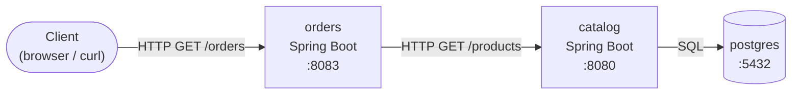
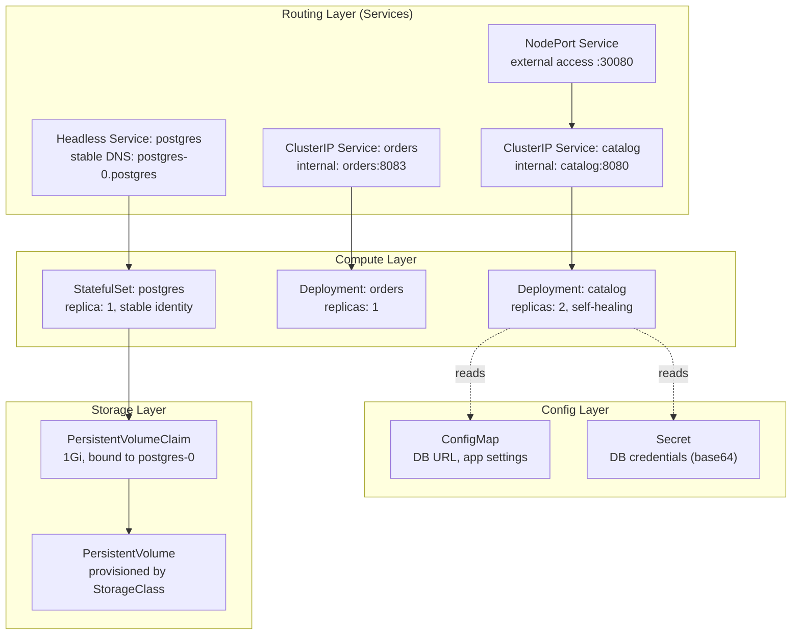
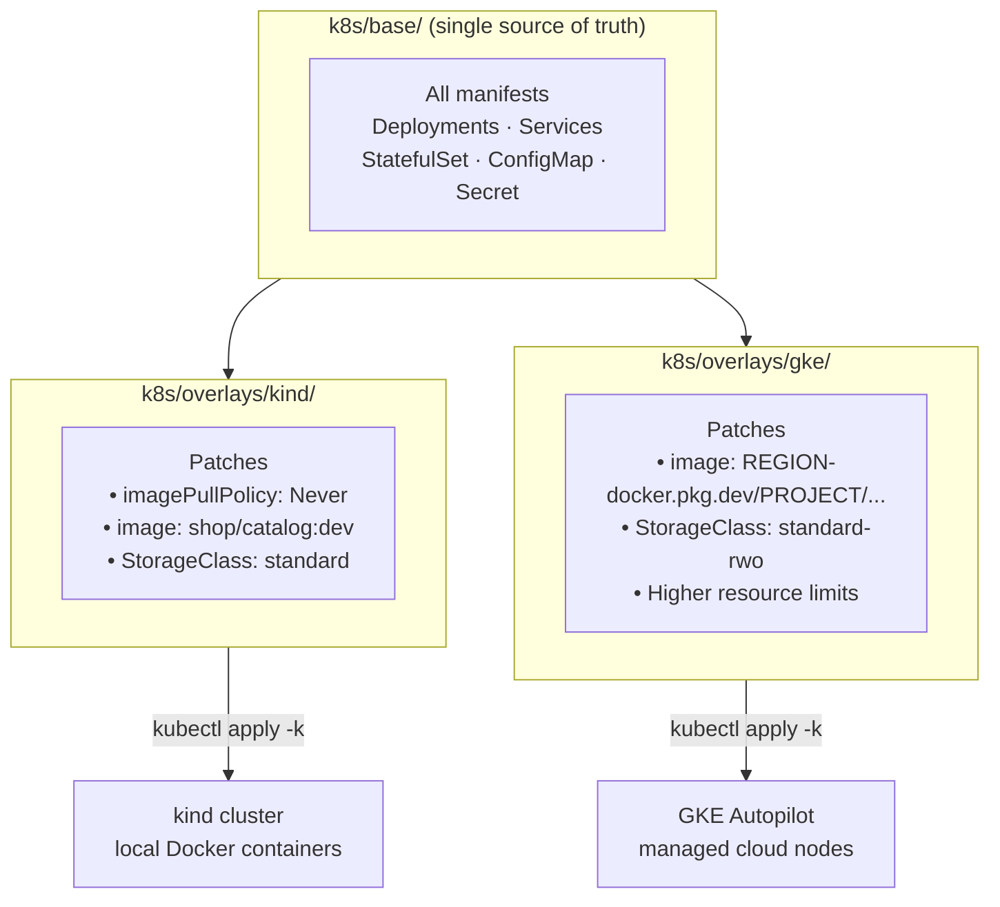

# System Design: Kubernetes Learning Journey

## 1. System Overview

We build a minimal three-service system whose sole purpose is to exercise every major Kubernetes abstraction. The apps themselves are deliberately trivial — the infrastructure around them is the lesson.

**Services:**
- `catalog` — Spring Boot REST API; returns product data queried from postgres
- `orders` — Spring Boot REST API; fetches from catalog and returns a combined response
- `postgres` — PostgreSQL database storing product data

---

## 2. Application Architecture

The data flows in one direction: `orders` fetches from `catalog`, which queries `postgres`.



**Key design choice:** `orders` never talks to postgres directly. Data access is owned by `catalog`. This models a real microservice boundary — each service owns its data layer.

---

## 3. Kubernetes Object Layers

Each service is wrapped in Kubernetes abstractions. This diagram shows the full object model at steady state after Playbook 06:



**Reading the diagram:** Solid arrows are traffic routing. Dashed arrows are configuration injection. The Compute layer runs your code; the Routing layer makes it discoverable; the Config layer externalises environment-specific values; the Storage layer persists data across pod restarts.

---

## 4. Environment Progression: kind → GKE

The same application runs in two environments. Kustomize overlays handle the differences without duplicating YAML:



**What changes between environments:**

| Aspect | kind | GKE Autopilot |
|--------|------|---------------|
| Image source | `kind load docker-image` | Google Artifact Registry |
| Node management | Docker containers on your machine | Managed and autoscaled by Google |
| StorageClass | `standard` (kind default) | `standard-rwo` (GKE ReadWriteOnce) |
| External access | NodePort + `extraPortMappings` | Cloud Load Balancer |
| Resource limits | Learning defaults | Production-appropriate |

**Why `k8s/raw/` is never deleted:** `k8s/raw/` contains the plain YAML written during Playbooks 01–06. When Kustomize is introduced in Playbook 07, the files are *copied* to `k8s/base/` — not moved. Both directories coexist so you can diff raw YAML against the Kustomize output and see exactly what Kustomize adds.

---

## 5. Project Structure

```
apps/catalog/          Spring Boot catalog API
apps/orders/           Spring Boot orders API
kind/                  kind cluster configuration (extraPortMappings)
k8s/raw/               Plain YAML — written during Playbooks 01–06, never deleted
k8s/base/              Kustomize base — copy of raw/, created in Playbook 07
k8s/overlays/kind/     kind-specific patches
k8s/overlays/gke/      GKE-specific patches
playbooks/             Step-by-step executable guides (00–07)
docs/                  Specs, design docs, and living glossary
tasks/                 Implementation plan and task tracking
```

---

## 6. Key Design Decisions

| Decision | Choice | Why |
|----------|--------|-----|
| App complexity | Minimal (hardcoded JSON → JPA in Playbook 04) | Keep focus on K8s abstractions, not business logic |
| Framework & Runtime | Java 25 LTS, Spring Boot 4 | Align with spec; modern enterprise runtime |
| Image strategy | `docker build` + `kind load` locally; Artifact Registry on GKE | No registry needed for local work |
| Namespace | Single namespace `shop` | Simplicity; cross-namespace DNS is noted in CONCEPTS.md but not exercised |
| Kustomize approach | Copy, do not move, raw manifests | Learner can diff both approaches side by side |
| Postgres placement | In-cluster StatefulSet | The lesson is StatefulSets; production should use Cloud SQL |
| CONCEPTS.md | Living doc, filled by the learner after each playbook | Understanding > memorisation |

---

## 7. The Production Gap

This project is optimised for learning K8s objects, not production readiness. Before taking this system to production, these are the mandatory additions:

| Gap | Production Solution |
|-----|-------------------|
| Manual `kubectl apply` | GitOps via ArgoCD or Flux |
| Raw YAML / Kustomize | Helm for parameterised templating |
| No NetworkPolicies or RBAC | Granular network policies and service accounts |
| In-cluster postgres | Managed DB (Cloud SQL, RDS) |
| No TLS or external DNS | cert-manager + ExternalDNS |
| `kubectl logs` only | Prometheus + Grafana + centralised logging |
