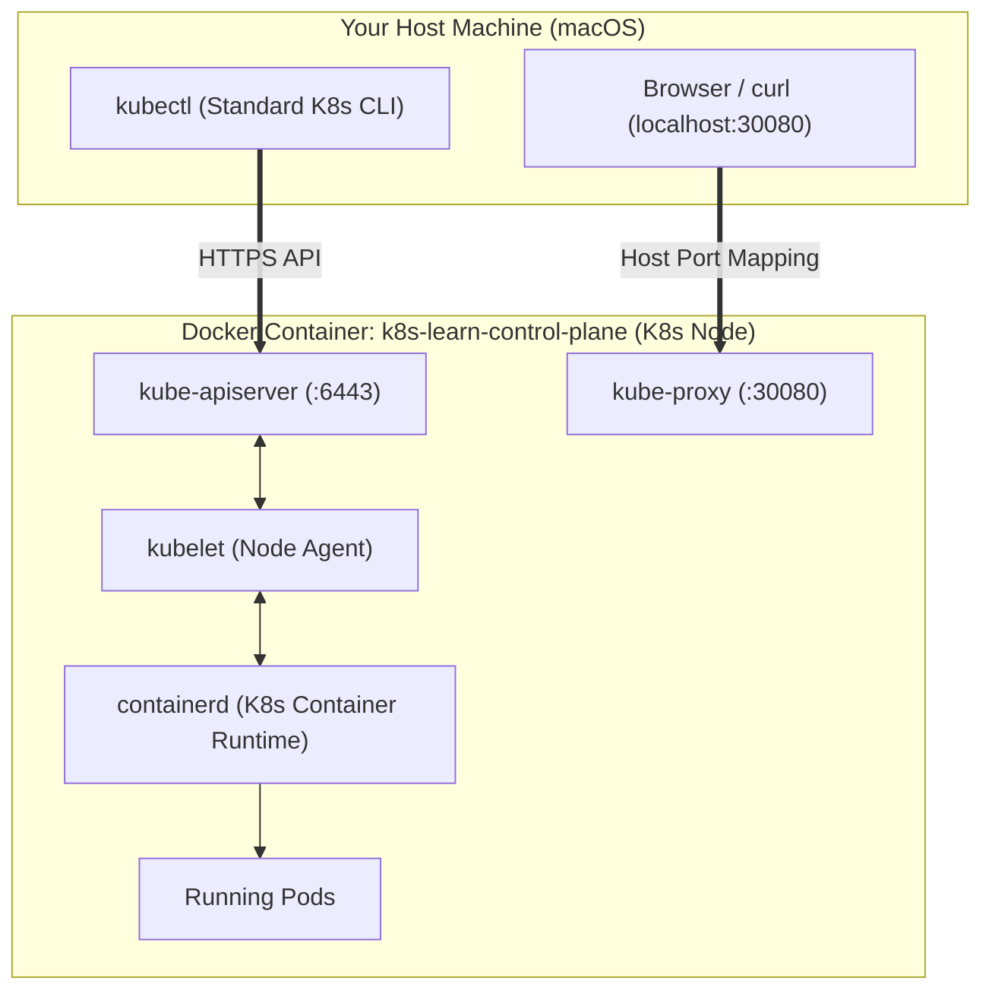
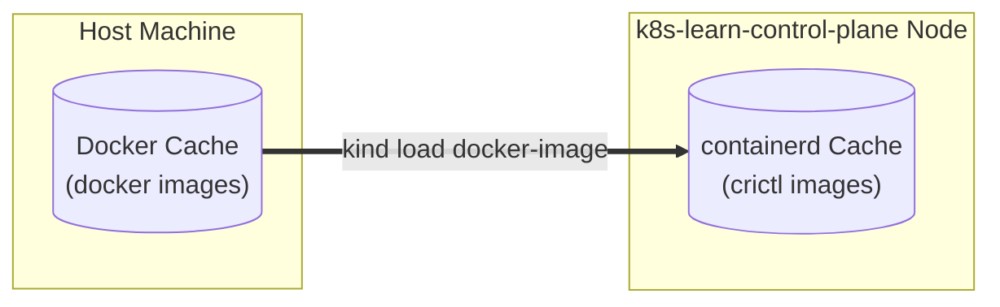

# Playbook 00: Build & Containerize

## Architect's Concept
Before Kubernetes can orchestrate your workloads, those workloads need to exist as **container images**. This playbook bridges the gap between source code and the K8s manifests used in later playbooks.

**Key insight:** `kind` runs a full Kubernetes cluster inside Docker containers. It cannot pull from your local Docker daemon by default — you must explicitly **load** images into the cluster with `kind load docker-image`.

*Boundary Check:* We build images locally and load them into `kind`. No remote registry is involved until Playbook 07 (GKE).

## Prerequisites

Verify all tools are installed (see the spec's Prerequisites section):

```bash
docker --version && kind --version && kubectl version --client && java -version && mvn -version
```

## Implementation Steps

### 1. Understanding the Build Context and `.dockerignore`

When you run `docker build [context_path]`:
- The Docker CLI packages everything in `context_path` and sends it to the Docker Daemon as the **build context**.
- **Why don't we need the host's `target/` folder in the Docker image?**
  There are two contrasting container build patterns:
  1. *Host-dependent (Single-stage):* You compile on your host Mac (`mvn package`), and the Dockerfile does `COPY target/*.jar app.jar`. In this pattern, `target/` is needed, but your builds are brittle (relies on host JDK, host OS settings, and can fail across different machines).
  2. *Self-contained (Multi-stage — our approach):*
     - **Stage 1 (`builder`):** Copies *only* source code (`src/`) and Maven configs (`pom.xml`, wrapper). Docker executes `./mvnw clean package` **inside an isolated Linux container**.
     - This produces a clean, reproducible `target/` folder **inside the builder container filesystem** (`/workspace/target/`).
     - **Stage 2 (`runtime`):** Docker copies *only* the single fat JAR (`COPY --from=builder /workspace/target/*.jar app.jar`) into the slim JRE image.
     - **Result:** The host's local `target/` folder is completely redundant. If `.dockerignore` didn't exclude it, Docker would waste time tarring and transmitting tens of megabytes of host binaries that Stage 1 ignores anyway. Furthermore, runtime images never need the extra debris in `target/` (thousands of `.class` files, build logs, and compiler caches).

---

### 2. Build the Container Images & Understanding Image Tags

#### Anatomy of a Docker Image Name & Tag
Docker image references follow this structure:
```
[registry_host[:port]/][namespace_or_org/]repository:tag
```

| Type | Example | What it means |
|------|---------|---------------|
| **Official Docker Hub** | `postgres:16-alpine` | Implicit registry `docker.io/library`. Pulled automatically from public Docker Hub. |
| **Cloud Registry (GKE)** | `asia-docker.pkg.dev/my-project/shop/catalog:1.0.0` | Remote image stored in Google Artifact Registry; requires authentication. |
| **Local-Only Tag** | `shop/catalog:dev` | Stored exclusively in your local Docker daemon. No network upload or download. |

#### Why use a local tag like `shop/catalog:dev`?
1. **Local identification:** `shop` is a project namespace, `catalog` is the service, and `:dev` indicates a local iteration.
2. **Avoiding the `:latest` trap in Kubernetes:**
   - If you tag an image `:latest` (or omit the tag), Kubernetes automatically defaults `imagePullPolicy: Always`.
   - On a local `kind` cluster, Kubernetes would try to reach Docker Hub to pull `shop/catalog:latest`, fail with `ErrImagePull`, and ignore the locally loaded image.
   - By giving it a specific local tag like `:dev`, we can use `imagePullPolicy: IfNotPresent` or `Never`, telling Kubernetes to run the image already present on the cluster node.

```bash
# Build the catalog image
docker build -t shop/catalog:dev apps/catalog/

# Build the orders image
docker build -t shop/orders:dev apps/orders/
```

#### Command Breakdown:
- `docker build`: Command to assemble a container image from a `Dockerfile`.
- `-t shop/catalog:dev`: Tag flag (`-t` / `--tag`). Assigns the name `shop/catalog` with tag `:dev`.
- `apps/catalog/`: The directory containing the `Dockerfile` and source files (the **build context**).

Inspect the resulting images and sizes:
```bash
docker images | grep shop
```
*Notice how small the final image is: only the slim JRE and the fat JAR are present; the Maven compiler and dependencies from Stage 1 were discarded.*

---

### 3. Smoke Test Containers Locally

Before loading images into Kubernetes, verify that the containers start and respond to HTTP traffic. You can run them in the foreground (blocking) or non-interactively in the background (detached).

#### Option A: Foreground Mode (Blocking)
Useful for quick testing where you want to watch the Spring Boot startup logs directly in the terminal:

```bash
docker run --rm -p 8080:8080 shop/catalog:dev
```
*(Press `Ctrl+C` to stop)*

---

#### Option B: Non-Interactive / Detached Mode with Custom Name (`-d` and `--name`)
When you want to free up your terminal and avoid keeping multiple tabs open, run the container in **detached mode** (`-d`) and give it a **memorable name** (`--name`):

```bash
# Run catalog in background named "catalog-app"
docker run -d --rm --name catalog-app -p 8080:8080 shop/catalog:dev

# Run orders in background named "orders-app"
docker run -d --rm --name orders-app -p 8083:8083 shop/orders:dev
```

#### Test with `curl`:
```bash
curl http://localhost:8080/
# Expected: {"service":"catalog","status":"ok"}

curl http://localhost:8083/
# Expected: {"service":"orders","status":"ok"}
```

#### Managing Detached Containers:
```bash
# 1. View running containers
docker ps

# 2. Stream logs from a named container (follow mode)
docker logs -f catalog-app

# 3. Stop containers (they are automatically removed due to --rm)
docker stop catalog-app
docker stop orders-app
```

---

#### Command Breakdown:
| Flag / Argument | Purpose |
|---|---|
| `docker run` | Creates and starts a new container instance from an image. |
| `-d` / `--detach` | **Non-interactive / background mode.** Runs container in background and prints container ID. Leaves terminal free. |
| `--name <name>` | **Assigns a custom name** (e.g., `catalog-app`). Without this, Docker generates a random name like `peaceful_curie`. Named containers are much easier to reference in `docker logs` and `docker stop`. |
| `--rm` | **Auto-cleanup.** Automatically deletes the container and its writable layer upon termination, preventing stopped container clutter. |
| `-p <host>:<container>` | **Port forwarding.** E.g., `-p 8080:8080` maps host `localhost:8080` to container port `8080`. |
| `shop/catalog:dev` | The container image repository and tag to execute. |

---

### 4. Create the `kind` Cluster

#### Understanding the kind Architecture

Before running the command, it is important to understand what `kind` is doing behind the scenes.



- **What is a Node?** A compute machine. `kind` (Kubernetes IN Docker) simulates a full Kubernetes Node by running it entirely inside a single Docker container named `k8s-learn-control-plane`.
- **`kubectl` is universal.** It is the standard K8s CLI, not specific to `kind`. When you create the cluster, `kind` configures `~/.kube/config` so `kubectl` knows how to talk to the `kube-apiserver` running inside the Docker container.
- **Port Mapping.** The `kind/cluster-config.yaml` file tells Docker to forward port `30080` from your Mac into the Node container. Without this, local testing in Playbook 02 would fail.

```bash
# Create a cluster named k8s-learn using our config (maps NodePort 30080 to localhost:30080)
kind create cluster --name k8s-learn --config kind/cluster-config.yaml

# Verify the cluster is running and kubectl is pointed at it
kubectl cluster-info --context kind-k8s-learn
```

---

### 5. Load Images into `kind`

#### The Image Store Boundary

Kubernetes uses `containerd` as its internal container runtime to start and stop processes. In `kind`, `containerd` runs entirely isolated inside the `k8s-learn-control-plane` container. 

This creates a boundary between your Mac's Docker daemon and the Kubernetes Node's runtime:



Because your custom images (`shop/*:dev`) are built locally and not pushed to a public registry like Docker Hub, the cluster cannot download them. You must explicitly push them across the boundary into the Node's internal cache:

```bash
kind load docker-image shop/catalog:dev --name k8s-learn
kind load docker-image shop/orders:dev --name k8s-learn
```

> **Note:** The official `postgres` image will be pulled directly from Docker Hub by `kind` when we create the StatefulSet in Playbook 03. No manual loading is needed for public images.

## Verify & Prove: Peeking Under the Hood

Run this command to step inside the node container and check `containerd`'s internal storage:

```bash
# Confirm the images are available inside the kind cluster's nodes
docker exec -it k8s-learn-control-plane crictl images | grep shop

# Expected output:
# docker.io/shop/catalog    dev    <hash>    <size>
# docker.io/shop/orders     dev    <hash>    <size>
```

#### Detailed Command Breakdown:
| Component | What it does |
|---|---|
| `docker exec -it` | Executes a command **inside an already running Docker container** with an interactive terminal session (`-i` interactive, `-t` allocate TTY). |
| `k8s-learn-control-plane` | The target container (the Kubernetes Node). |
| `crictl` | **Container Runtime Interface CLI**. The debugging tool used to inspect `containerd` directly (analogous to `docker` CLI for Docker). |
| `images` | Subcommand of `crictl` that lists all images stored in `containerd`. |
| `\| grep shop` | Filters the list to verify our `shop/catalog` and `shop/orders` images are present. |

## What's Next

With images loaded into the cluster, proceed to [Playbook 01: The Basics](01-basics.md) to create your first Deployment.

## Rebuild Workflow (Reference)

After making code changes, re-run this cycle:

```bash
# Rebuild → Reload → Restart
./mvnw clean package -DskipTests -f apps/catalog/pom.xml
docker build -t shop/catalog:dev apps/catalog/
kind load docker-image shop/catalog:dev --name k8s-learn
kubectl rollout restart deployment/catalog -n shop
```
