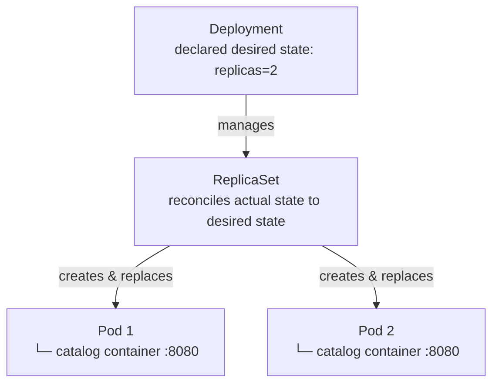

# Playbook 01: The Basics (Compute)

## Architect's Concept

**Pods** are the smallest deployable unit in Kubernetes. They wrap one or more containers and share a network namespace and storage. A Pod is ephemeral — if it dies, it is gone.

**ReplicaSets** solve the ephemerality problem. They watch the cluster and ensure a specified number of identical Pods are always running. If a Pod dies, the ReplicaSet creates a replacement.

**Deployments** are what you actually create. A Deployment manages a ReplicaSet and adds declarative rollout and rollback capabilities on top.



*Boundary check:* You declare intent to the Deployment. The Deployment owns the ReplicaSet. The ReplicaSet owns the Pods. You never manage Pods directly — that would bypass the self-healing loop.

---

## Implementation Steps

1. Create a namespace `shop`.
2. Write a Deployment YAML (`k8s/raw/01-catalog-deployment.yaml`) for the `catalog` application.
3. Use the `shop/catalog:dev` image with `imagePullPolicy: Never` (required for kind-loaded images).
4. Set `replicas: 2`.

---

## 🤚 Execution

> These commands are yours to run. Do not skip observing the state transitions.

```bash
# Ensure the cluster is running
kind get clusters

# Create the namespace
kubectl create namespace shop

# Apply the Deployment
kubectl apply -f k8s/raw/01-catalog-deployment.yaml -n shop
```

---

## 🤚 Verify & Prove

```bash
# Watch pods start up in real time (Ctrl+C to stop)
kubectl get pods -n shop -l app=catalog -w

# Check the deployment
kubectl get deployments -n shop

# Prove self-healing: delete a pod and watch the ReplicaSet replace it
POD_NAME=$(kubectl get pods -n shop -l app=catalog -o jsonpath="{.items[0].metadata.name}")
kubectl delete pod $POD_NAME -n shop
kubectl get pods -n shop -w
```

---

## 🤚 What to Observe

**When pods start:** Watch the state transitions in `-w` mode — `Pending` → `ContainerCreating` → `Running`. Notice that pod names have a random suffix (e.g., `catalog-7d9f4b-xkp2m`). The ReplicaSet generated those names — you did not.

**When you delete a pod:** The moment the pod is deleted, the ReplicaSet detects a mismatch: *desired=2, actual=1*. It immediately schedules a new Pod. Watch how quickly a replacement appears. This is the declarative model in action: you declared intent (replicas: 2), Kubernetes continuously enforces it.

**Architectural insight:** You never instructed Kubernetes to "restart the pod." You declared the desired state, and the control loop brought reality into alignment. This is the core mental shift from imperative ops to Kubernetes.

---

## Teardown (Optional)

```bash
kubectl delete -f k8s/raw/01-catalog-deployment.yaml -n shop
```

---

## 📝 After This Playbook

Fill in the **Pods**, **ReplicaSets & Deployments** sections in [`docs/CONCEPTS.md`](../docs/CONCEPTS.md) in your own words before moving to Playbook 02.
