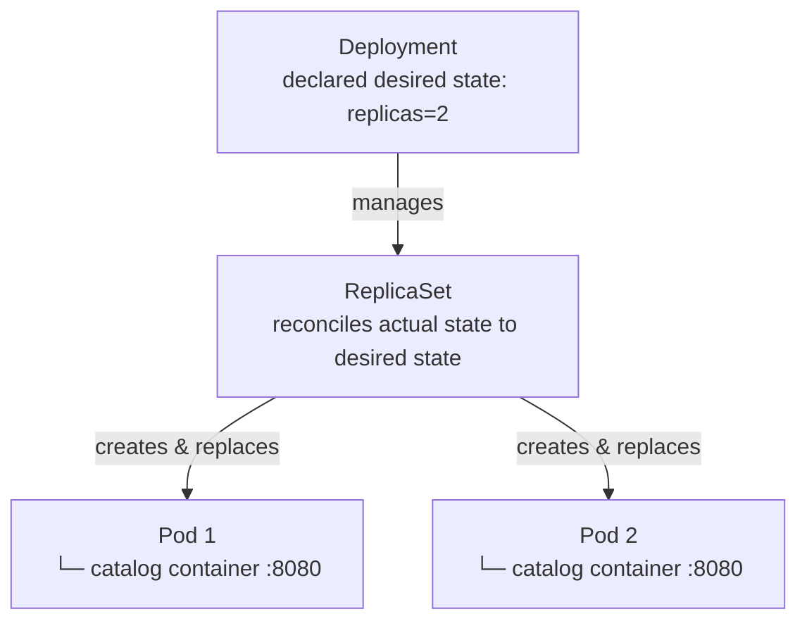
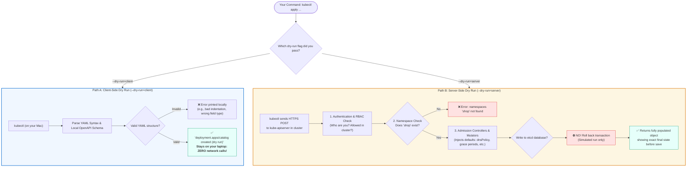
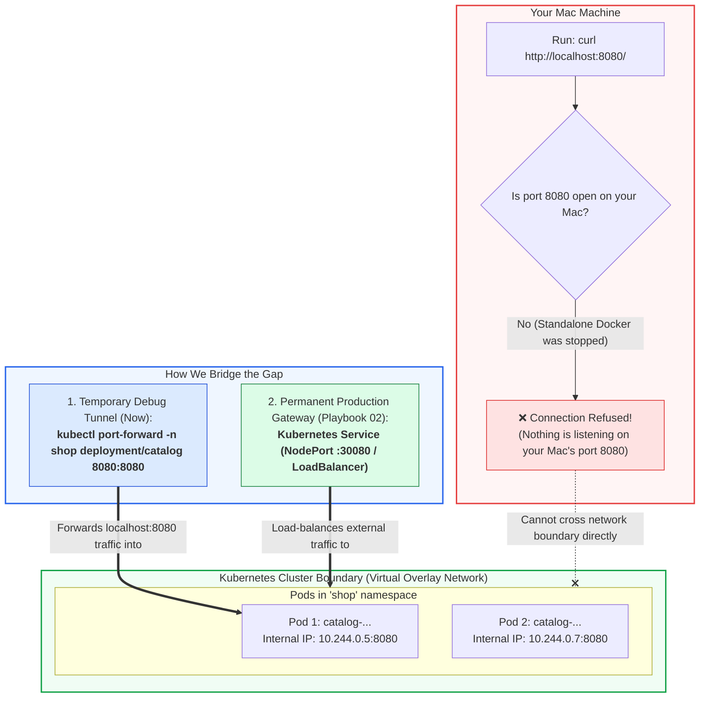

# Playbook 01: The Basics (Compute)

## Architect's Concept

**Pods** are the smallest deployable unit in Kubernetes. They wrap one or more containers and share a network namespace and storage. A Pod is ephemeral — if it dies, it is gone.

**ReplicaSets** solve the ephemerality problem. They watch the cluster and ensure a specified number of identical Pods are always running. If a Pod dies, the ReplicaSet creates a replacement.

**Deployments** are what you actually create. A Deployment manages a ReplicaSet and adds declarative rollout and rollback capabilities on top.



*Boundary check:* You declare intent to the Deployment. The Deployment owns the ReplicaSet. The ReplicaSet owns the Pods. You never manage Pods directly — that would bypass the self-healing loop.

---

## 🧭 Deep Dives: Concepts You Must Know

### 1. Client-Side vs. Server-Side Dry Run: What Do They Mean?

When you run `kubectl apply`, there are two sides involved:
- **Client:** The `kubectl` binary running locally on your Mac.
- **Server:** The `kube-apiserver` running in the Kubernetes Control Plane.



- **Client-side (`--dry-run=client`):** Checks basic YAML formatting and schema types on your machine without contacting the cluster. Catches typos and invalid fields offline.
- **Server-side (`--dry-run=server`):** Reaches out to the real cluster. The cluster validates that the target namespace (`shop`) exists, checks permissions, and runs admission webhooks to inject cluster defaults. It simulates the full creation cycle without committing changes to `etcd`.

---

### 2. Real World: Where Does Kubernetes & Docker Run?

| Aspect | In Local Learning (`kind`) | In Real-World Cloud (GCP GKE / AWS EKS) |
|---|---|---|
| **Control Plane** | Runs inside a Docker container (`k8s-learn-control-plane`) on your Mac. | Fully managed by Google or AWS on dedicated, redundant VMs. You never manage or SSH into it. |
| **Worker Nodes** | Simulated inside the same Docker container. | Real Linux VMs (e.g. Google Compute Engine VMs or AWS EC2 instances) joined to the cluster. |
| **Container Runtime** | `containerd` inside the Docker container. | `containerd` installed natively on the Linux VMs. Docker Desktop is not used on server nodes. |
| **Serverless Option** | N/A | **GKE Autopilot** or **AWS Fargate**: The cloud provider manages the nodes entirely; you only declare Pods! |

---

### 3. Namespaces & How to Visualize Them

A **Namespace** is a virtual cluster / logical partition inside your Kubernetes cluster. It isolates resource names, access controls, and quotas.

#### Where can you see it?
1. **Command Line:**
   ```bash
   # List all namespaces in the cluster
   kubectl get namespaces

   # List all resources specifically inside the shop namespace
   kubectl get all -n shop
   ```
2. **Local Graphical UIs:**
   - **`k9s` (Industry Favorite):** A lightning-fast, interactive terminal UI (`brew install derailed/k9s/k9s`). Running `k9s` gives you a visual dashboard where you press `:ns` to browse and select namespaces, view logs, and exec into pods.
   - **Lens / Headlamp:** Standalone desktop GUI applications for Kubernetes that connect to your `~/.kube/config`.
3. **Cloud Consoles (GCP / AWS):**
   - **Google Cloud Console (GCP):** Navigate to **Kubernetes Engine → Workloads** or **Object Browser**. A dropdown at the top lets you filter by namespace (`shop`). You see graphical CPU/memory graphs, live pod status, and click-to-view logs.
   - **AWS Console (EKS):** Navigate to **Elastic Kubernetes Service → Clusters → [Cluster Name] → Resources → Namespaces**.

---

### 4. Why Did `curl localhost:8080` Give No Response? (The Networking Gap)

This is the single most important conceptual milestone in Kubernetes networking:



- In **Task 3 (Standalone Docker)**: You ran `docker run -p 8080:8080`. Docker explicitly bound port 8080 on your Mac to the container.
- In **Task 7 (Kubernetes Deployment)**: Kubernetes launched 2 Pods. Kubernetes gave them **internal virtual IPs** (e.g. `10.244.0.5` and `10.244.0.7`).
- **Pods are completely private by default.** They exist inside an internal cluster overlay network. Nothing on your Mac is listening on `localhost:8080`.
- **How to reach a Pod right now (Temporary Debugging Tunnel):**
  ```bash
  kubectl port-forward -n shop deployment/catalog 8080:8080
  ```
  *(While this is running in one tab, `curl http://localhost:8080/` in another tab will succeed!)*
- **How to reach Pods in production:** You create a **Kubernetes Service** (`ClusterIP`, `NodePort`, or `LoadBalancer`). That is the exact topic of **Playbook 02 (Networking)**!

---

## Implementation Steps

1. Create a namespace `shop`.
2. Write a Deployment YAML (`k8s/raw/01-catalog-deployment.yaml`) for the `catalog` application.
3. Use the `shop/catalog:dev` image with `imagePullPolicy: Never` (required for kind-loaded images).
4. Set `replicas: 2`.

---

## 🤚 Execution

> These commands are yours to run. Do not skip observing the state transitions.

```bash
# Ensure the cluster is running
kind get clusters

# Create the namespace
kubectl create namespace shop

# Apply the Deployment
kubectl apply -f k8s/raw/01-catalog-deployment.yaml -n shop
```

---

## 🤚 Verify & Prove

```bash
# Watch pods start up in real time (Ctrl+C to stop)
kubectl get pods -n shop -l app=catalog -w

# Check the deployment
kubectl get deployments -n shop

# Prove self-healing: delete a pod and watch the ReplicaSet replace it
POD_NAME=$(kubectl get pods -n shop -l app=catalog -o jsonpath="{.items[0].metadata.name}")
kubectl delete pod $POD_NAME -n shop
kubectl get pods -n shop -w
```

---

## 🤚 What to Observe

**When pods start:** Watch the state transitions in `-w` mode — `Pending` → `ContainerCreating` → `Running`. Notice that pod names have a random suffix (e.g., `catalog-7d9f4b-xkp2m`). The ReplicaSet generated those names — you did not.

**When you delete a pod:** The moment the pod is deleted, the ReplicaSet detects a mismatch: *desired=2, actual=1*. It immediately schedules a new Pod. Watch how quickly a replacement appears. This is the declarative model in action: you declared intent (replicas: 2), Kubernetes continuously enforces it.

**Architectural insight:** You never instructed Kubernetes to "restart the pod." You declared the desired state, and the control loop brought reality into alignment. This is the core mental shift from imperative ops to Kubernetes.

---

## Teardown (Optional)

```bash
kubectl delete -f k8s/raw/01-catalog-deployment.yaml -n shop
```

---

## 📝 After This Playbook

Fill in the **Pods**, **ReplicaSets & Deployments** sections in [`docs/CONCEPTS.md`](../docs/CONCEPTS.md) in your own words before moving to Playbook 02.
