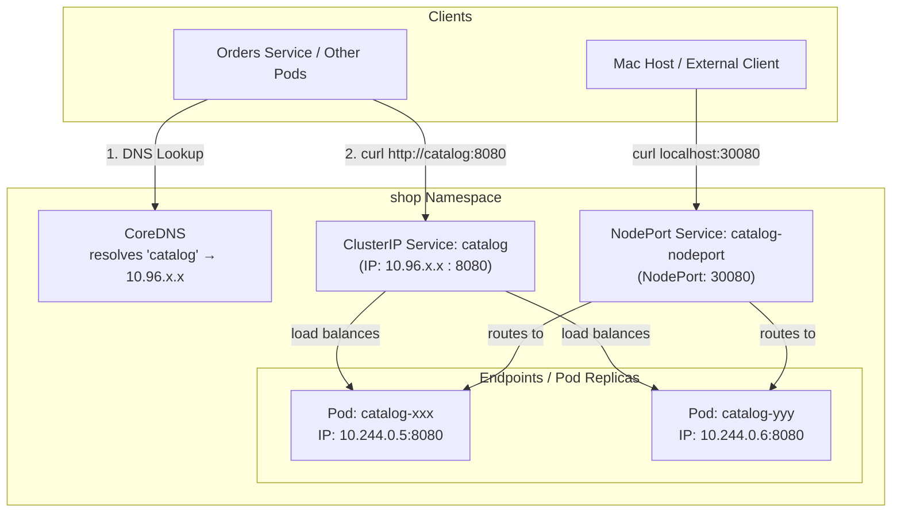
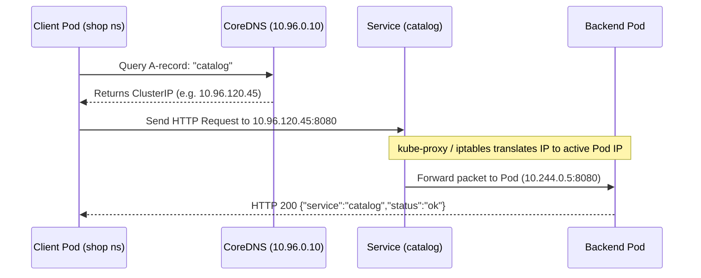

# Playbook 02: Networking (Services & DNS)

## Architect's Concept

In [Playbook 01](01-basics.md), we proved that Pods are ephemeral: when a pod crashes or is deleted, the ReplicaSet creates a brand-new pod with a **different private IP address**.

If client applications or other microservices (like our upcoming `orders` service) tried to connect directly to Pod IPs:
1. Every time a Pod restarted, connections would break.
2. Clients would need custom client-side load-balancing logic to split traffic across replicas.
3. Pods on different nodes or subnets might not even have easily reachable direct routes.

A **Kubernetes Service** is an abstraction that defines a logical set of Pods and a policy to access them. It gives you:
1. **Stable Virtual IP (`ClusterIP`):** An unchanging IP address that stays alive as long as the Service exists.
2. **Stable Internal DNS Name:** Automatically registered in Kubernetes internal CoreDNS (e.g., `catalog` inside the `shop` namespace, or `catalog.shop.svc.cluster.local` across namespaces).
3. **Automatic Load Balancing:** Traffic hitting the Service is transparently distributed across all healthy Pods matching the Service's `selector`.
4. **Decoupled Lifecycle:** Pods can die, restart, or scale from 2 to 20 replicas without clients ever needing to know.



---

## 🧭 Deep Dives: Concepts You Must Know

### 1. How Internal Cluster DNS Works

Inside Kubernetes, a built-in DNS server (**CoreDNS**) runs in the `kube-system` namespace. 

When any Pod makes a network request to an address like `http://catalog:8080`:
1. The Pod checks `/etc/resolv.conf`, which points to the CoreDNS service IP (typically `10.96.0.10`).
2. The search domains configured in the Pod include:
   - `shop.svc.cluster.local` (current namespace)
   - `svc.cluster.local`
   - `cluster.local`
3. Therefore, typing `catalog` inside the `shop` namespace expands to its Fully Qualified Domain Name (**FQDN**):
   ```
   catalog.shop.svc.cluster.local
   ```
4. CoreDNS replies with the Service's stable **ClusterIP**.



---

### 2. Under the Hood: Services Don't Have Containers

A common beginner misconception is that a Service is a container or proxy process running somewhere in the cluster. **It is not.**

- A Service is merely a row in `etcd` (the cluster database) and a virtual IP managed by the API server.
- The glue connecting Services to Pods is the **`Endpoints`** (and modern **`EndpointSlice`**) object.
- Whenever a Pod with label `app: catalog` becomes `Ready`, Kubernetes automatically adds the Pod's private IP and port to the Service's `Endpoints`.
- **`kube-proxy`** (a daemon running on every node) watches these Endpoints and configures Linux kernel packet-filtering rules (`iptables` or `IPVS`). When traffic hits the ClusterIP, the Linux kernel itself redirects the packets directly to one of the Pod IPs!

```bash
# You can view the actual pod IPs behind the service at any time:
kubectl get endpoints catalog -n shop
kubectl get endpointslices -n shop
```

---

### 3. Service Types: ClusterIP vs. NodePort vs. LoadBalancer

| Service Type | Reachable From | Use Case | How It Works |
|---|---|---|---|
| **`ClusterIP`** *(Default)* | **Inside the cluster only** | Microservice-to-microservice communication (e.g. `orders` → `catalog`). | Assigns an internal-only virtual IP from the cluster IP pool. |
| **`NodePort`** | **Inside cluster + Outside node on port 30000–32767** | Dev testing, bare-metal clusters, or direct node access. | Allocates a static port on *every* worker node's physical IP address. |
| **`LoadBalancer`** | **The public Internet or corporate VPC** | Production external-facing web apps and public APIs. | Requests a managed Cloud Load Balancer (AWS NLB/ALB, GCP Cloud LB) and routes to NodePort/ClusterIP. |
| **`Headless`** (`clusterIP: None`) | **Inside the cluster via direct Pod DNS** | Stateful databases (PostgreSQL, Kafka) requiring 1-to-1 addressability. | Covered in [Playbook 03](03-state.md)! |

---

### 4. Why NodePort Needs `extraPortMappings` in `kind`

In a real bare-metal or cloud VM cluster, your Mac could reach a NodePort by typing `http://<Node-IP>:30080`.

However, our `kind` cluster runs entirely inside a single Docker container (`k8s-learn-control-plane`) on your Mac. The "Node IP" is private to Docker's bridge network.

That is why in **Playbook 00** we created `kind/cluster-config.yaml` with:
```yaml
nodes:
- role: control-plane
  extraPortMappings:
  - containerPort: 30080
    hostPort: 30080
    protocol: TCP
```
This instructed Docker to forward traffic from `localhost:30080` on your Mac directly into port `30080` of the `kind` container, allowing you to test NodePort services in your browser or with `curl`!

---

### 5. Why Minimal Production Images Don't Have `curl`

Our `shop/catalog:dev` container is built on `eclipse-temurin:25-jre` — a lean, production-grade runtime image. It intentionally does **not** include debugging utilities like `curl`, `wget`, or package managers.

This is a security and operational best practice:
- **Smaller image size** (faster pull and startup times).
- **Reduced attack surface** (attackers who exploit an application cannot easily download malicious binaries).

To test in-cluster networking without bloating our production image, we use an **ephemeral debug Pod** (`curlimages/curl` or `busybox`), which runs once, verifies the connection, and cleans itself up (`--rm`).

---

## Implementation Steps

1. Inspect the running catalog deployment to ensure labels are `app: catalog`.
2. Review `k8s/raw/02-catalog-service.yaml` — creates a `ClusterIP` Service exposing port `8080`.
3. Review `k8s/raw/02-catalog-nodeport.yaml` — creates a `NodePort` Service mapping port `8080` to static nodePort `30080`.
4. Apply both manifests in the `shop` namespace.
5. Verify internal DNS resolution and routing using a temporary `curlimages/curl` pod.
6. Verify external access from your host Mac using `curl http://localhost:30080`.

---

## 🤚 Execution

> Run these commands in your terminal. Observe the outputs closely.

### Step 1: Apply the ClusterIP Service

```bash
# Validate with dry-run first
kubectl apply --dry-run=client -f k8s/raw/02-catalog-service.yaml

# Apply the ClusterIP Service
kubectl apply -f k8s/raw/02-catalog-service.yaml -n shop
```

**Command Breakdown:**
- `kubectl apply`: Declares your desired state to Kubernetes. If the resource doesn't exist, it creates it; if it already exists, it updates it.
- `--dry-run=client`: Runs a local syntax check on your Mac without sending any data to the Kubernetes cluster.
- `-f k8s/raw/02-catalog-service.yaml`: Specifies the YAML manifest file containing the Service definition.
- `-n shop`: Targets the `shop` namespace where our catalog pods live.

---

### Step 2: Inspect the Service and Endpoints

```bash
# Check the Service details
kubectl get svc -n shop catalog

# Check the active Pod IPs attached to the Service
kubectl get endpoints -n shop catalog
kubectl get endpointslices -n shop -l kubernetes.io/service-name=catalog
```

**Command Breakdown:**
- `kubectl get svc -n shop catalog`: Lists the Service named `catalog` in namespace `shop`. Shows its `TYPE` (ClusterIP), `CLUSTER-IP` (virtual IP), and `PORT(S)` (`8080/TCP`).
- `kubectl get endpoints -n shop catalog`: Inspects the `Endpoints` resource automatically generated for `catalog`. This shows the exact Pod private IPs and ports currently receiving traffic.
- `kubectl get endpointslices ...`: Checks the modern, scalable version of Endpoints (`EndpointSlice`).
- `-l kubernetes.io/service-name=catalog`: Filters EndpointSlices by label so you only see the one belonging to `catalog`.

---

### Step 3: Test Internal Cluster DNS & Routing

Launch an ephemeral test pod inside the `shop` namespace to query the service by its short DNS name `catalog`:

```bash
kubectl run curl-test --image=curlimages/curl:8.5.0 --rm -i --tty --restart=Never -n shop -- curl -s http://catalog:8080/
```

*(Expected output: `{"service":"catalog","status":"ok"}`)*

You can also verify that the Fully Qualified Domain Name (FQDN) resolves:

```bash
kubectl run curl-test --image=curlimages/curl:8.5.0 --rm -i --tty --restart=Never -n shop -- curl -s http://catalog.shop.svc.cluster.local:8080/
```

**Command Breakdown:**
- `kubectl run curl-test`: Creates and runs a single standalone Pod named `curl-test`.
- `--image=curlimages/curl:8.5.0`: The container image to run (a lightweight Alpine Linux container with `curl` pre-installed).
- `--rm`: Automatically deletes the `curl-test` Pod as soon as the command completes, keeping your cluster clean.
- `-i --tty` (or `-it`): Attaches an interactive session and terminal so you see the command output immediately.
- `--restart=Never`: Tells Kubernetes not to restart this Pod when it finishes (treat it as a one-off task, not a long-running service).
- `-n shop`: Runs this test pod inside the `shop` namespace so it shares the same DNS search domain.
- `--`: Separator indicating that everything following is the actual command to execute inside the container.
- `curl -s http://catalog:8080/`: Fetches the catalog service using its in-cluster DNS name. The `-s` flag runs curl silently (hiding progress meters, showing only the JSON response).

---

### Step 4: Apply the NodePort Service

```bash
# Apply the NodePort Service
kubectl apply -f k8s/raw/02-catalog-nodeport.yaml -n shop

# Verify that catalog-nodeport has allocated port 30080
kubectl get svc -n shop catalog-nodeport
```

**Command Breakdown:**
- `kubectl apply -f k8s/raw/02-catalog-nodeport.yaml -n shop`: Creates the `catalog-nodeport` Service in the `shop` namespace.
- `kubectl get svc -n shop catalog-nodeport`: Checks the status of the NodePort service. Look at the `PORT(S)` column: you will see `8080:30080/TCP`, meaning internal port `8080` is mapped to node port `30080`.

---

### Step 5: Test External Access from Your Host Mac

Now test accessing the catalog service directly from your Mac terminal or web browser:

```bash
curl http://localhost:30080/
```

*(Expected output: `{"service":"catalog","status":"ok"}`)*

**Command Breakdown:**
- `curl`: Standard HTTP client running directly on your Mac terminal (outside Kubernetes).
- `http://localhost:30080/`: Hits port `30080` on your Mac. Because of `extraPortMappings` in `kind/cluster-config.yaml`, Docker routes this traffic into the `kind` node container, where Kubernetes forwards it to the catalog pods.

---

## 🤚 Verify & Prove

### Proof 1: Verify Endpoints Match Pod IPs

Run:
```bash
# 1. Print the actual IPs of the catalog Pods
kubectl get pods -n shop -l app=catalog -o wide

# 2. Print the Service Endpoints
kubectl get endpoints catalog -n shop
```

**Command Breakdown:**
- `kubectl get pods -n shop`: Lists all pods in the `shop` namespace.
- `-l app=catalog`: Filters by label selector so only catalog pods are returned.
- `-o wide`: Outputs additional columns, specifically the internal `IP` (e.g. `10.244.0.5`) and `NODE` where each pod runs.
- `kubectl get endpoints catalog -n shop`: Displays the IPs that Kubernetes routed to. Compare this with the `IP` column above — they are identical!

---

### Proof 2: Prove Self-Healing & Dynamic Endpoint Updates

Watch how the Service seamlessly survives Pod deletion:

```bash
# 1. Delete one of the catalog pods
POD_NAME=$(kubectl get pods -n shop -l app=catalog -o jsonpath="{.items[0].metadata.name}")
kubectl delete pod $POD_NAME -n shop

# 2. Immediately check the endpoints again
kubectl get endpoints catalog -n shop

# 3. Query from your Mac host without missing a beat:
curl http://localhost:30080/
```

**Command Breakdown:**
- `POD_NAME=$(...)`: Runs a command inside `$()` and saves the resulting text into a shell variable named `POD_NAME`.
- `-o jsonpath="{.items[0].metadata.name}"`: Extracts just the name of the first pod in the returned list, avoiding manual copy-pasting.
- `kubectl delete pod $POD_NAME -n shop`: Kills that specific pod to simulate a failure or crash.
- `kubectl get endpoints catalog -n shop`: Shows that the ReplicaSet created a new pod with a *new* IP, and Kubernetes automatically updated the Service endpoints in real time.
- `curl http://localhost:30080/`: Confirms that from the user's perspective, the service stayed online without downtime.

---

## 🤚 What to Observe

1. **Virtual IP vs Pod IP:** Run `kubectl get svc -n shop catalog`. Look at the `CLUSTER-IP` column. Notice this IP is distinct from any Pod IP. It is a stable gateway that never changes unless the Service itself is deleted.
2. **Selector Magic:** The Service found the Pods solely because `spec.selector.app: catalog` matched `spec.template.metadata.labels.app: catalog` on the Deployment. If you changed the label on a pod, the Service would instantly drop it from its endpoints.
3. **Internal vs External Access:**
   - Inside the cluster: `http://catalog:8080/`
   - Outside the cluster (Mac): `http://localhost:30080/`
   No `kubectl port-forward` was needed.

---

## Teardown (Optional)

If you need to remove the Services without removing the Deployment:

```bash
kubectl delete -f k8s/raw/02-catalog-service.yaml -n shop
kubectl delete -f k8s/raw/02-catalog-nodeport.yaml -n shop
```

**Command Breakdown:**
- `kubectl delete -f <file>`: Removes the resources specified in the YAML files from the cluster.
- `-n shop`: Specifies the namespace to delete them from. Your catalog Pods and Deployment will remain completely untouched.

---

## 📝 After This Playbook

Fill in the **Services & DNS** section in [`docs/CONCEPTS.md`](../docs/CONCEPTS.md) in your own words before moving to Playbook 03.
