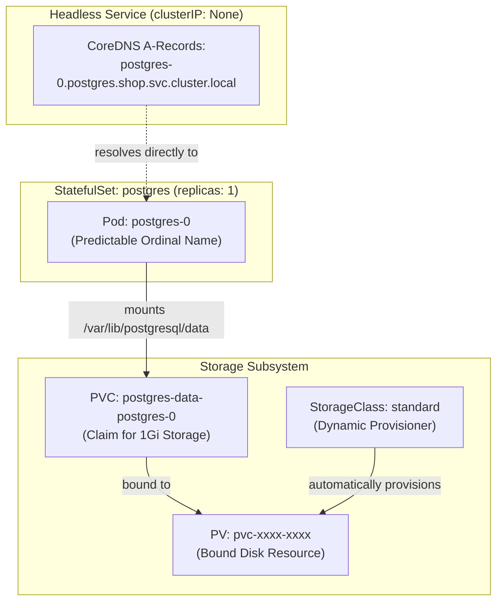
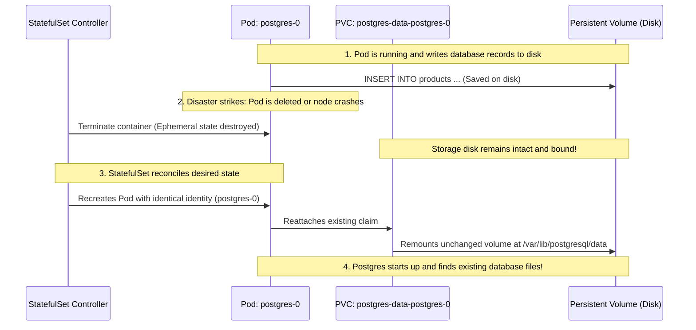
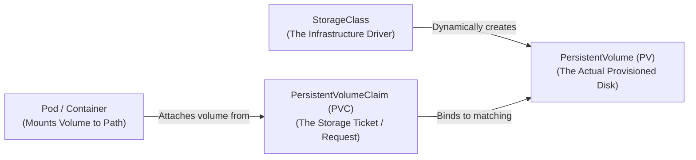

# Playbook 03: State (StatefulSets, Storage, & Persistent Volumes)

## Architect's Concept

In [Playbook 01](01-basics.md) and [Playbook 02](02-networking.md), we ran stateless compute (`catalog`). Stateless applications treat pods as cattle: if a pod crashes, a replacement spawns with a random name, an empty filesystem, and a new IP address. Because `catalog` keeps no local state between requests, this ephemeral lifecycle is desirable.

Databases are fundamentally different. A database requires:
1. **Durable Storage:** Data written to disk must survive container crashes, pod restarts, and node failures.
2. **Stable Network Identity:** Database replicas, backups, and clients need predictable hostnames (e.g., `postgres-0`, `postgres-1`), not randomized strings like `catalog-65c64f565c-r24pp`.
3. **Ordered Deployment & Scaling:** Nodes must start and stop sequentially (node 0 first, then node 1, etc.) to prevent split-brain issues or race conditions in distributed storage.

Kubernetes provides the **StatefulSet** controller specifically for stateful workloads. Paired with **Persistent Volumes (PV)**, **Persistent Volume Claims (PVC)**, and a **Headless Service**, it decouples the database compute process from the underlying storage disk.



*Boundary check:* The Pod is still an ephemeral Linux container. If it crashes, the container is destroyed. But the **PersistentVolumeClaim** is independent: when the StatefulSet controller recreates `postgres-0`, it reattaches the exact same persistent storage disk back to `/var/lib/postgresql/data`.



---

## 🧭 Deep Dives: Concepts You Must Know

### 1. The Architectural Difference: Deployment vs. StatefulSet

| Dimension | Deployment (Stateless) | StatefulSet (Stateful) |
|---|---|---|
| **Primary Workloads** | Web APIs (`catalog`, `orders`), proxies, microservices. | Databases (`postgres`, `mysql`, `redis`, `kafka`, `mongodb`). |
| **Pod Naming** | Random unique hash (e.g. `catalog-65c64f565c-r24pp`). | Deterministic ordinal index (e.g. `postgres-0`, `postgres-1`). |
| **Storage Sharing** | Ephemeral container filesystem or shared read-only volumes. | Dedicated PersistentVolumeClaim per pod via `volumeClaimTemplates`. |
| **Storage Lifecycle** | Destroyed when pod is destroyed (unless manually attached). | **Preserved indefinitely**; never deleted automatically when pods are deleted. |
| **Scaling Order** | Parallel startup and shutdown. | Strictly sequential: 0 → 1 → 2 (startup) and 2 → 1 → 0 (shutdown). |
| **Network Identity** | Anonymous behind a shared virtual `ClusterIP`. | Stable DNS record per replica via a governing **Headless Service**. |

---

### 2. The Storage Hierarchy: StorageClass → PVC → PV → Pod Mount

Beginners often confuse PVs, PVCs, and StorageClasses. Here is the mental model:



1. **StorageClass (`SC`):** Defines the "flavor" of storage and who provisions it. On `kind`, it uses `rancher.io/local-path` (host directory mapping). On GKE, it uses Google Compute Engine Persistent Disks (`standard-rwo`).
2. **PersistentVolume (`PV`):** An actual storage volume in the cluster (e.g., a 1Gi folder on the host or a cloud disk).
3. **PersistentVolumeClaim (`PVC`):** A request for storage by a user or workload. It says: *"I need 1Gi of ReadWriteOnce storage"*. Kubernetes matches the claim to an available PV or uses the StorageClass to provision a new PV on-the-fly (**Dynamic Provisioning**).
4. **Volume Mount:** Maps the PVC inside the container's Linux filesystem (e.g., `/var/lib/postgresql/data`).

---

### 3. What is a Headless Service (`clusterIP: None`)?

In [Playbook 02](02-networking.md), our Service had a virtual `ClusterIP` (`10.96.164.136`). When traffic hit that IP, `kube-proxy` randomly picked one of the backing pods.

For databases, random load balancing is often disastrous:
- Distributed databases (like PostgreSQL with read replicas, Cassandra, or Kafka) require clients or clustering protocols to connect to the **Primary/Leader** specifically (e.g. `postgres-0`), or reach a specific follower node directly.
- Setting `clusterIP: None` creates a **Headless Service**.
- Instead of returning a single load-balanced virtual IP, CoreDNS configures individual A-records for each pod:
  ```text
  postgres-0.postgres.shop.svc.cluster.local  --> Resolves to postgres-0's exact IP
  ```
- If you query the base service name `postgres.shop.svc.cluster.local`, CoreDNS returns the direct IP(s) of the backing pods instead of a proxy IP.

---

### 4. Dynamic Provisioning on `kind` vs. Production Cloud

Run this command on your terminal to inspect your cluster's storage engine:
```bash
kubectl get storageclass
```
Output:
```text
NAME                 PROVISIONER             RECLAIMPOLICY   VOLUMEBINDINGMODE      ALLOWVOLUMEEXPANSION   AGE
standard (default)   rancher.io/local-path   Delete          WaitForFirstConsumer   false                  29h
```

Notice two critical settings:
- **`PROVISIONER: rancher.io/local-path`:** On `kind`, volumes are backed by directories inside the `k8s-learn-control-plane` Docker container. On GKE Autopilot, this is replaced by `pd.csi.storage.gke.io` (managed cloud SSD/HDD disks).
- **`VOLUMEBINDINGMODE: WaitForFirstConsumer`:** Kubernetes will not provision or bind the disk the moment you create the PVC. It waits until a Pod requesting the PVC is actually scheduled onto a node. This ensures the disk is created in the exact availability zone or host where the pod runs!

---

## Implementation Steps

We create two declarative manifests in `k8s/raw/`:

### 1. `k8s/raw/03-postgres-service.yaml` (Headless Service)
- Configures `clusterIP: None`.
- Targets port `5432` with label selector `app: postgres`.
- Acts as the governing service for the StatefulSet.

### 2. `k8s/raw/03-postgres-statefulset.yaml` (StatefulSet)
- Specifies `serviceName: "postgres"` (links to the headless service).
- Declares `replicas: 1` using the official `postgres:16-alpine` image.
- Sets environment variables:
  - `POSTGRES_DB: catalog`
  - `POSTGRES_USER: postgres`
  - `POSTGRES_PASSWORD: postgres`
  - `PGDATA: /var/lib/postgresql/data/pgdata` (sub-path avoids filesystem mount collisions).
- Declares `volumeClaimTemplates`: requests a 1Gi volume with `ReadWriteOnce` access mode mounted at `/var/lib/postgresql/data`.

---

## 🤚 Execution

Run these commands in your terminal to deploy the database.

```bash
# Step 1: Validate manifests locally with client dry-run
kubectl apply --dry-run=client -f k8s/raw/03-postgres-service.yaml
kubectl apply --dry-run=client -f k8s/raw/03-postgres-statefulset.yaml

# Step 2: Apply the Headless Service and StatefulSet in the shop namespace
kubectl apply -f k8s/raw/03-postgres-service.yaml -n shop
kubectl apply -f k8s/raw/03-postgres-statefulset.yaml -n shop
```

**Command Breakdown:**
- `kubectl apply -f <file> -n shop`: Creates or updates the headless Service and StatefulSet inside the `shop` namespace.
- `--dry-run=client`: Validates YAML syntax without modifying cluster state.

---

## 🤚 Verify & Prove: Data Persistence & Stable Identity

### Proof 1: Observe StatefulSet, Pod, and PVC Creation

```bash
# Watch the pod transition into Running
kubectl get pods -n shop -l app=postgres -w
```
*(Press `Ctrl+C` once the pod status is `Running` and `1/1 Ready`)*

Now inspect the storage resources created dynamically:
```bash
kubectl get statefulset,pvc,pv -n shop
```

**What to Observe:**
- Notice the pod name is `postgres-0` (deterministic ordinal, not a random hash).
- Notice a PVC named `postgres-data-postgres-0` was created automatically from the `volumeClaimTemplates`.
- Notice the PVC status is `Bound` to a `pv/pvc-...` volume provisioned by `standard`.

---

### Proof 2: Connect to PostgreSQL and Insert Data

Let's execute an interactive `psql` session inside `postgres-0` to create a table and insert a record.

```bash
kubectl exec -it postgres-0 -n shop -- psql -U postgres -d catalog
```

Inside the `psql` prompt (`catalog=#`), run the following SQL commands:

```sql
-- 1. Create a table
CREATE TABLE items (id SERIAL PRIMARY KEY, name VARCHAR(50));

-- 2. Insert a test record
INSERT INTO items (name) VALUES ('Kubernetes In Action');

-- 3. Verify the row was saved
SELECT * FROM items;

-- 4. Exit psql
\q
```

You should see:
```text
 id |         name         
----+----------------------
  1 | Kubernetes In Action
(1 row)
```

---

### Proof 3: Disaster Simulation — Delete the Database Pod

Now, let's simulate a crash or worker node failure by forcibly deleting the `postgres-0` pod:

```bash
kubectl delete pod postgres-0 -n shop
```

Watch how Kubernetes reacts in real time:
```bash
kubectl get pods -n shop -l app=postgres -w
```
*(Press `Ctrl+C` once `postgres-0` returns to `Running`)*

**What to Observe:**
- The deleted pod was replaced with a new pod having the **exact same name**: `postgres-0`.
- The ReplicaSet was NOT involved. The **StatefulSet controller** detected that ordinal index `0` was missing and recreated it.

---

### Proof 4: Verify the Data Survived Intact

Now, let's connect to the newly created `postgres-0` pod and query the table:

```bash
kubectl exec -it postgres-0 -n shop -- psql -U postgres -d catalog -c "SELECT * FROM items;"
```

**Expected Output:**
```text
 id |         name         
----+----------------------
  1 | Kubernetes In Action
(1 row)
```

**Architectural Proof:**
The container that originally ran `psql` and accepted the `INSERT` query is dead and gone. Yet the data was not lost! The new `postgres-0` pod attached to the existing `postgres-data-postgres-0` PVC, mounted the volume, and PostgreSQL immediately re-opened the database cluster on disk.

---

### Proof 5: Test Headless DNS Resolution

Let's verify that CoreDNS resolves both the headless service name and the individual pod FQDN using a one-shot curl/DNS test pod:

```bash
kubectl run dns-test --image=curlimages/curl:8.5.0 --rm -i --restart=Never -n shop -- nslookup postgres-0.postgres.shop.svc.cluster.local
```

> 💡 **Tip:** We use `-i` (interactive stdin) without `--tty`. For ultra-fast commands like `nslookup`, passing `--tty` can cause the container to finish and terminate before the terminal TTY handshake completes, swallowing the output.

**What to Observe:**
- `nslookup` queries CoreDNS (`10.96.0.10`) and returns the direct IP of `postgres-0` (e.g. `10.244.0.15`).
- Unlike a ClusterIP Service, there is no virtual load-balancer IP in between. The client gets the direct IP of the specific stateful replica.

---

## 🤚 What to Observe: The Architect's Takeaways

1. **Pod Identity is Invariant:** Deployment pods are interchangeable and anonymous (`catalog-xxx`, `catalog-yyy`). StatefulSet pods are ordered, unique, and index-based (`postgres-0`).
2. **Storage Decoupling:** Pods come and go; PVCs stay. The PVC outlives the Pod lifecycle.
3. **Safety by Default:** If you run `kubectl delete statefulset postgres -n shop`, Kubernetes deletes the StatefulSet controller and the pods, **but leaves the PVC untouched!** This deliberate design prevents catastrophic accidental data loss. To delete the data, an operator must explicitly delete the PVC.

---

## Teardown (Optional)

> ⚠️ **Do not run this if you are continuing to Playbook 04!**  
> Playbook 04 wires the `catalog` Spring Boot application to this exact Postgres database.

If you ever need to clean up and wipe the database completely:
```bash
# 1. Delete the StatefulSet and Service
kubectl delete -f k8s/raw/03-postgres-statefulset.yaml -n shop
kubectl delete -f k8s/raw/03-postgres-service.yaml -n shop

# 2. Notice the PVC still exists!
kubectl get pvc -n shop

# 3. Explicitly delete the persistent volume claim to free the disk
kubectl delete pvc postgres-data-postgres-0 -n shop
```

---

## 📝 After This Playbook

Fill in the **StatefulSets & Persistent Volumes** section in [`docs/CONCEPTS.md`](../docs/CONCEPTS.md) with your own notes before proceeding to [Playbook 04 (Configuration)](04-configuration.md).
