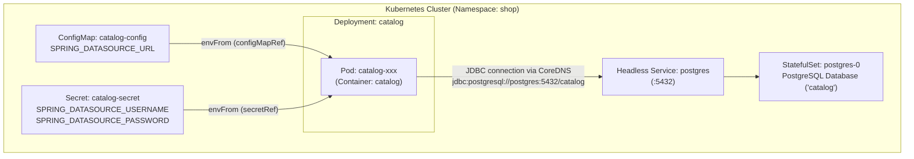
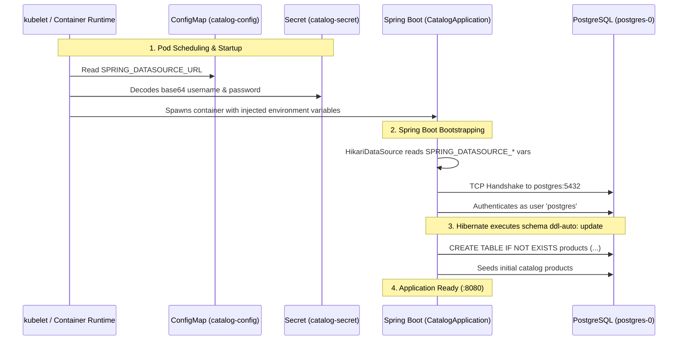
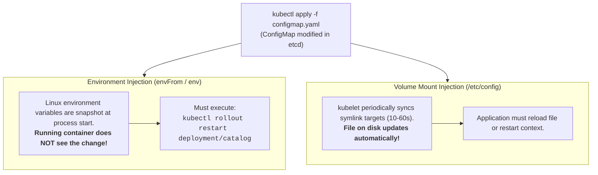
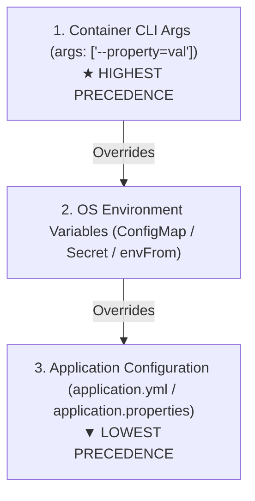

# Playbook 04: Configuration (ConfigMaps, Secrets, & The 12-Factor App)

## Architect's Concept

In modern cloud-native engineering, a container image must be **strictly immutable and environment-agnostic**. The exact same container image artifact (`shop/catalog:dev` or `shop/catalog:v1.0.0`) must be capable of running unchanged in local development, QA, staging, and multi-region production.

This principle is codified in **Factor III of The Twelve-Factor App**:
> *"Store config in the environment. An app’s config is everything that is likely to vary between deploys (credentials, database URLs, backing service hostnames)."*

Baking database passwords or environment-specific URLs into Docker images creates severe security risks and forces expensive rebuilds for simple configuration tweaks. Kubernetes provides two first-class primitives to externalize configuration:

1. **`ConfigMap`:** Stores non-confidential configuration key-value pairs (database URLs, feature flags, application profiles).
2. **`Secret`:** Stores sensitive credentials, API tokens, TLS certificates, and passwords.

When injected into Pods via `envFrom`, Kubernetes translates ConfigMap and Secret keys directly into Linux environment variables available to the container runtime. Spring Boot automatically binds these variables (`SPRING_DATASOURCE_URL`, `SPRING_DATASOURCE_USERNAME`, `SPRING_DATASOURCE_PASSWORD`) to its datasource configuration without writing a single line of custom parsing code!



*Boundary check:* The container image knows *how* to connect to a relational database using JPA/Hibernate, but it has zero knowledge of *where* that database lives or what password it requires until Kubernetes orchestrates the Pod and mounts the configuration.



---

## 🧭 Deep Dives: Concepts You Must Know

### 1. Injection Patterns: `envFrom` vs. Specific Keys vs. Volume Mounts

Kubernetes offers three primary ways to supply ConfigMaps and Secrets to containers:

| Pattern | Syntax | Best Used For | Pros & Cons |
|---|---|---|---|
| **Bulk Environment (`envFrom`)** | `envFrom: [configMapRef, secretRef]` | Spring Boot / 12-Factor applications that use standardized variable names (`SPRING_*`). | **Pros:** Clean YAML; all keys exposed instantly.<br/>**Cons:** Name collision risk if ConfigMap and Secret share keys. |
| **Selective Environment (`valueFrom`)** | `env: - name: DB_URL valueFrom: configMapKeyRef:...` | Fine-grained injection; mapping non-standard config keys to existing app variables. | **Pros:** Explicit, precise mapping.<br/>**Cons:** Verbose YAML for dozens of config keys. |
| **File Volume Mounts** | `volumeMounts: - mountPath: /etc/config` | Complex structured configs (JSON, YAML, XML, Prometheus rules, TLS `.crt`/`.key` files). | **Pros:** Supports multi-megabyte files; live updates propagate without restarting pods.<br/>**Cons:** App must watch filesystem for file changes. |

---

### 2. The Secrets "Security Myth": Base64 Is Not Encryption

A common misconception is that Kubernetes Secrets are securely encrypted by default. 

```text
echo -n "postgres" | base64        -->  cG9zdGdyZXM=
echo -n "cG9zdGdyZXM=" | base64 -d -->  postgres
```

- **Base64 is strictly an encoding scheme**, designed to allow binary data to be safely transmitted through text-based YAML/JSON APIs. It offers **zero confidentiality**. Anyone with read access to the cluster namespace can decode the secret in one command:
  ```bash
  kubectl get secret catalog-secret -n shop -o jsonpath="{.data.SPRING_DATASOURCE_PASSWORD}" | base64 -d
  ```
- **How Production Secures Secrets:**
  1. **RBAC:** Strictly limit which users and ServiceAccounts can `get` or `view` Secret resources.
  2. **etcd Encryption at Rest:** Enable `EncryptionConfiguration` on the control plane so etcd stores secrets encrypted with AES-CBC or KMS keys.
  3. **External Secrets Operator (ESO) / HashiCorp Vault / Google Secret Manager:** In enterprise environments, secrets are maintained in external secret managers (AWS Secrets Manager, GCP Secret Manager, Vault) and synced into K8s at runtime, never committed to git repositories.

---

### 3. Config Dynamics: Do Config Changes Trigger Automatic Restarts?

What happens if you edit `SPRING_DATASOURCE_URL` in the ConfigMap while pods are running?



**Key Takeaway:** Environment variables injected into containers are immutable for the lifetime of that Linux process. When you update a ConfigMap or Secret used via `envFrom`, you must trigger a rolling restart of the Deployment to recreate the pods with the new configuration.

---

### 4. How Does Spring Boot Resolve Variables? (Relaxed Binding vs. `${...}` vs. CLI `args`)

A common question is: *Why did our `application.yml` not require `${SPRING_DATASOURCE_USERNAME}` placeholders?*

#### 1. Canonical Relaxed Binding (Zero Boilerplate)
Spring Boot has built-in canonical mapping from environment variables to internal properties:
- `SPRING_DATASOURCE_URL` &rarr; `spring.datasource.url`
- `SPRING_DATASOURCE_USERNAME` &rarr; `spring.datasource.username`
- `SPRING_DATASOURCE_PASSWORD` &rarr; `spring.datasource.password`

When an environment variable matches this naming convention, Spring Boot automatically discovers and binds it. No placeholders in `application.yml` are required!

#### 2. Custom Placeholders (`${...}`)
If you declare custom application properties, you map them explicitly in `application.yml` with optional fallbacks:
```yaml
catalog:
  welcome-message: ${CATALOG_WELCOME_MESSAGE:Default Welcome from Catalog}
```
If `CATALOG_WELCOME_MESSAGE` is present in the ConfigMap or OS environment, Spring Boot injects its value; otherwise, it defaults to `"Default Welcome from Catalog"`.

#### 3. The Spring Boot Precedence Hierarchy (Highest to Lowest)
What wins if a property is declared in multiple places?



In Kubernetes, you can pass command-line arguments to your container via the `args:` field in `01-catalog-deployment.yaml`. Container `args` override both ConfigMaps and `application.yml`!

---

## Implementation Steps

### 1. `k8s/raw/04-catalog-configmap.yaml`
Declares non-sensitive configuration:
- `SPRING_DATASOURCE_URL: jdbc:postgresql://postgres:5432/catalog`
- Points directly to the headless service `postgres` on port `5432` inside the `shop` namespace.

### 2. `k8s/raw/04-catalog-secret.yaml`
Declares sensitive credentials:
- `SPRING_DATASOURCE_USERNAME: cG9zdGdyZXM=` (base64 for `postgres`)
- `SPRING_DATASOURCE_PASSWORD: cG9zdGdyZXM=` (base64 for `postgres`)

### 3. `k8s/raw/01-catalog-deployment.yaml`
Updated the `catalog` container spec with `envFrom`:
```yaml
        envFrom:
        - configMapRef:
            name: catalog-config
        - secretRef:
            name: catalog-secret
```

### 4. `apps/catalog` Application Code
- Added `spring-boot-starter-data-jpa` and `org.postgresql:postgresql` runtime dependencies to `pom.xml`.
- Created `Product` JPA entity mapping to table `products`.
- Created `ProductRepository` extending `JpaRepository<Product, Long>`.
- Configured Hibernate `ddl-auto: update` in `application.yml`.
- Added `GET /products` and `POST /products` endpoints in `CatalogController`.
- Seeded initial catalog items on startup via `CommandLineRunner` in `CatalogApplication`.

---

## 🤚 Execution

Run the following commands in your terminal to package the updated application, rebuild the container image, load it into your local `kind` cluster, and apply the configuration manifests.

### Step 1: Rebuild the Catalog Docker Image
```bash
# Rebuild the application and docker image with JPA + PostgreSQL driver
docker build -t shop/catalog:dev apps/catalog/
```

### Step 2: Load the Updated Image into `kind`
```bash
# Push the updated image into the kind node's containerd image cache
kind load docker-image shop/catalog:dev --name k8s-learn
```

### Step 3: Validate and Apply Configuration & Deployment Manifests
```bash
# 1. Validate manifests locally with client dry-run
kubectl apply --dry-run=client -f k8s/raw/04-catalog-configmap.yaml
kubectl apply --dry-run=client -f k8s/raw/04-catalog-secret.yaml
kubectl apply --dry-run=client -f k8s/raw/01-catalog-deployment.yaml

# 2. Apply ConfigMap and Secret first
kubectl apply -f k8s/raw/04-catalog-configmap.yaml -n shop
kubectl apply -f k8s/raw/04-catalog-secret.yaml -n shop

# 3. Apply the updated Deployment
kubectl apply -f k8s/raw/01-catalog-deployment.yaml -n shop
```

---

## 🤚 Verify & Prove: Config Injection & Database Connectivity

### Proof 1: Verify Environment Variables in Pod Specification
Find the newly running catalog pod and inspect its environment bindings:

```bash
# Get the catalog pod name
POD_NAME=$(kubectl get pods -n shop -l app=catalog -o jsonpath="{.items[0].metadata.name}")

# Inspect the Environment section
kubectl describe pod $POD_NAME -n shop
```

**What to Observe:**
Scroll down to the `Containers: catalog: Environment Variables from:` section:
```text
Environment Variables from:
  catalog-config  ConfigMap  Optional: false
  catalog-secret  Secret     Optional: false
```
Notice Kubernetes references the ConfigMap and Secret sources directly. The credentials themselves are not dumped in plain text in the pod description.

---

### Proof 2: Verify Successful Database Connection in Application Logs
Inspect the Spring Boot startup logs to observe Hibernate and HikariPool connecting to PostgreSQL:

```bash
kubectl logs -l app=catalog -n shop --tail=100
```

**What to Observe:**
Look for the database handshake log lines:
```text
HikariPool-1 - Added connection org.postgresql.jdbc.PgConnection@...
HikariPool-1 - Start completed.
HH000400: Using dialect: org.hibernate.dialect.PostgreSQLDialect
...
Tomcat started on port 8080 (http) with context path '/'
Started CatalogApplication in ... seconds
```
This confirms:
1. CoreDNS resolved `postgres` to `postgres-0`'s IP address.
2. Spring Boot retrieved `SPRING_DATASOURCE_URL`, `USERNAME`, and `PASSWORD` from the injected environment.
3. Hibernate authenticated with PostgreSQL and initialized the table structure.

---

### Proof 3: Test `GET /products` Through Internal Cluster Networking
Run a one-shot testing curl pod inside the `shop` namespace to hit the catalog service:

```bash
kubectl run test-curl --image=curlimages/curl:8.5.0 --rm -i --restart=Never -n shop -- curl -s http://catalog:8080/products
```

**Expected JSON Output:**
```json
[
  {
    "id": 1,
    "name": "Kubernetes in Action",
    "price": 49.99,
    "description": "Comprehensive guide to Kubernetes architecture and primitives"
  },
  {
    "id": 2,
    "name": "Cloud Native Patterns",
    "price": 39.99,
    "description": "Designing resilient microservices in modern cloud infrastructure"
  }
]
```

---

### Proof 4: Cross-Verify Data Directly Inside PostgreSQL
Confirm that the Spring Boot application actually wrote records to the persistent database volume on `postgres-0`:

```bash
kubectl exec -i postgres-0 -n shop -- psql -U postgres -d catalog -c "SELECT * FROM products;"
```

**Expected Output:**
```text
 id |          name          | price |                         description                          
----+------------------------+-------+--------------------------------------------------------------
  1 | Kubernetes In Action   | 49.99 | Comprehensive guide to Kubernetes architecture and primitives
  2 | Cloud Native Patterns  | 39.99 | Designing resilient microservices in modern cloud infrastructure
(2 rows)
```

The loop is closed:
- **`postgres-0`** (StatefulSet + Persistent Volume) hosts the data on disk.
- **`catalog`** (Deployment) consumes dynamic credentials from ConfigMap & Secret.
- **`catalog:8080`** (Service) serves REST requests powered by a real relational database!

---

## 🤚 What to Observe: The Architect's Takeaways

1. **Separation of Concerns:** 
   The application code is completely agnostic of Kubernetes or its operational environment. The Java developer writes standard Spring Boot properties; the DevOps/K8s engineer manages environment injection using ConfigMaps and Secrets.
2. **True Image Portability:**
   The container image `shop/catalog:dev` contains only compiled bytecode and libraries. You can deploy this identical image into AWS, GCP, Azure, or local kind simply by supplying different ConfigMaps and Secrets.
3. **Graceful Failure:**
   If you accidentally misspell a database password in `catalog-secret`, Kubernetes still starts the container, but Spring Boot's health checks / startup fails with `PSQLException: password authentication failed`. In Playbook 06, we will see how Kubernetes Readiness and Liveness Probes prevent broken containers from ever receiving customer traffic.

---

## Teardown (Optional)

> ⚠️ **Do not run this if you are continuing to Playbook 05!**  
> Playbook 05 deploys the `orders` service to communicate with this live `catalog` database service.

If you ever need to clean up the configuration objects:
```bash
kubectl delete -f k8s/raw/04-catalog-configmap.yaml -n shop
kubectl delete -f k8s/raw/04-catalog-secret.yaml -n shop
```

---

## 📝 After This Playbook

Fill in the **ConfigMaps & Secrets** section in [`docs/CONCEPTS.md`](../docs/CONCEPTS.md) with your notes before proceeding to [Playbook 05 (Communication)](05-communication.md).
