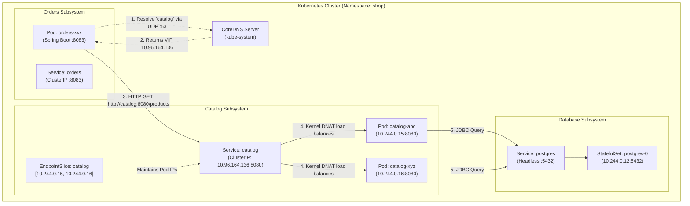
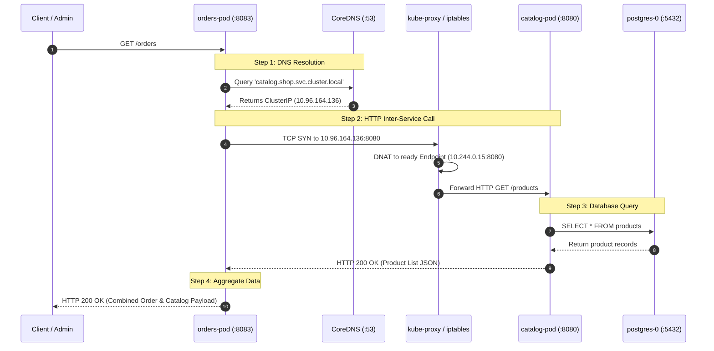
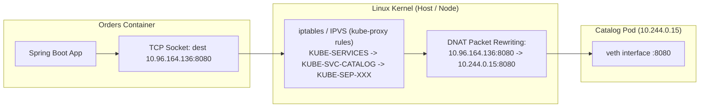

# Playbook 05: Communication (Internal DNS, Service Discovery, & Microservices)

## Architect's Concept

In monolithic architectures, components communicate via in-memory function calls. In a cloud-native microservices architecture, components communicate across the network via remote procedure calls or HTTP APIs.

However, containerized environments introduce a critical challenge: **Pods are ephemeral, disposable, and assigned volatile IP addresses**. A pod can be evicted, rescheduled, or scaled at any moment. If the `orders` service had to track the individual, dynamic IP addresses of the `catalog` pods, you would need complex external service registries (like Netflix Eureka, Consul, or ZooKeeper) and invasive client-side SDKs.

Kubernetes solves service discovery at the **infrastructure layer** through two foundational primitives:
1. **CoreDNS:** An authoritative in-cluster DNS server that dynamically maintains DNS `A`/`AAAA` and `SRV` records for every Service created in the cluster.
2. **Kubernetes Service (ClusterIP):** Provides a stable, unchanging Virtual IP (VIP) and a durable DNS hostname. The Linux kernel (`kube-proxy` via `iptables` or `IPVS`) intercepts traffic directed to this VIP and distributes it across the actual, healthy Pod endpoints.

Because Kubernetes implements service discovery through standard DNS and TCP/IP, applications require **zero proprietary client libraries**. Standard HTTP clients (like Spring's modern `RestClient` or `curl`) simply use standard hostnames like `http://catalog:8080`.



*Architectural Principle:* Location transparency. The caller (`orders`) depends strictly on an abstract service contract and a DNS hostname. The physical location, scale, and lifecycle of the callee (`catalog`) are completely hidden.



---

## 🧭 Deep Dives: Concepts You Must Know

### 1. The Anatomy of a Kubernetes DNS Name (FQDN)

Inside a Kubernetes cluster, DNS names follow a strict hierarchical structure defined by the Kubernetes DNS specification:

$$\Huge \underbrace{\text{catalog}}_{\text{Service}}.\underbrace{\text{shop}}_{\text{Namespace}}.\underbrace{\text{svc}}_{\text{Resource Type}}.\underbrace{\text{cluster.local}}_{\text{Cluster Domain}}$$

| Segment | Meaning | Example |
|---|---|---|
| **Service Name** | The name given in `metadata.name` of the Service. | `catalog` |
| **Namespace** | The Kubernetes namespace where the Service resides. | `shop` |
| **Resource Type** | Distinguishes Services (`svc`) from Pods (`pod`). | `svc` |
| **Cluster Domain** | The internal top-level domain for the cluster (default: `cluster.local`). | `cluster.local` |

#### Intra-Namespace vs. Cross-Namespace Resolution

When a container runs inside Kubernetes, the kubelet injects a tailored `/etc/resolv.conf` file into every container filesystem:

```text
nameserver 10.96.0.10
search shop.svc.cluster.local svc.cluster.local cluster.local
options ndots:5
```

Because `shop.svc.cluster.local` is the very first entry in the `search` path:
- A query for `http://catalog:8080` automatically expands to `catalog.shop.svc.cluster.local`.
- If `catalog` and `orders` live in the **same namespace (`shop`)**, you can use the short name: `http://catalog:8080`.
- If `orders` was moved to a different namespace (e.g. `billing`), querying `catalog` would search `billing.shop.svc.cluster.local` and fail! To call across namespaces, you **must** specify the namespace: `http://catalog.shop:8080` or the full FQDN `http://catalog.shop.svc.cluster.local:8080`.

---

### 2. ClusterIP is a VIP, Not a Network Interface

A common misconception is that a Service's `ClusterIP` (such as `10.96.164.136`) is bound to a network card on a host or container.

**The Reality:** If you log into any worker node or container and run `ip addr` or `ifconfig`, you will **never** find the ClusterIP. It does not exist as an interface!



1. The ClusterIP is simply an entry in the kernel's `iptables` or `IPVS` connection tracking (`conntrack`) tables.
2. `kube-proxy` runs on every node and watches the Kubernetes API server for Services and Endpoints.
3. When a packet addresses `10.96.164.136:8080`, the kernel's Netfilter/iptables rules intercept it before it leaves the node, performs **Destination NAT (DNAT)**, and replaces the destination IP with one of the live Pod IPs (`10.244.0.15`).
4. This architecture provides near-zero overhead and eliminates any single-point-of-failure proxy bottleneck.

---

### 3. Endpoints vs. EndpointSlices: How Pod Churn is Handled

When a Service is created, how does Kubernetes know which Pods to route traffic to?

```yaml
spec:
  selector:
    app: catalog
```

1. **The Selector:** Kubernetes continuously matches the Service's `selector` against the labels of all running Pods.
2. **EndpointSlice:** For every matching Pod whose `ReadinessProbe` is successful (`Ready`), the Kubernetes `EndpointSlice` controller publishes its IP and port into an `EndpointSlice` object.
3. **Pod Death / Replacement:** If a catalog Pod crashes or gets replaced during a deployment:
   - The Pod is marked `Terminating`.
   - The EndpointSlice controller instantly removes the Pod's IP from the slice.
   - `kube-proxy` removes the corresponding DNAT rule.
   - **The Service's ClusterIP and DNS name do NOT change.** The `orders` service continues making requests to `http://catalog:8080` without experiencing downtime or needing a configuration reload.

---

### 4. Modern Spring Boot Microservice Communication: `RestClient`

In Spring Boot 4 / Spring 6+, the legacy `RestTemplate` is in maintenance mode and external Netflix Ribbon/Eureka libraries are obsolete. 

The modern, recommended pattern for synchronous HTTP communication is **Spring `RestClient`**:
- **Fluent, synchronous API:** Offers the expressive syntax of `WebClient` without requiring reactive streams or `Project Reactor`.
- **Environment-driven Base URL:** Configured with a baseUrl injected from Kubernetes environment variables (`CATALOG_URL`).
- **Resilient Fallback:** Gracefully catches network/DNS timeouts and returns degraded status rather than throwing unhandled 500 exceptions.

```java
this.restClient = RestClient.builder()
    .baseUrl(catalogUrl) // Injected from CATALOG_URL env var
    .build();
```

---

## Implementation Manifests & Code

### 1. `apps/orders` Application Update
- **`OrdersController.java`:** Added `GET /orders` endpoint that utilizes `RestClient` to query `http://catalog:8080/products` and combines the response with order metadata.
- **`application.yml`:** Added `catalog.url: ${CATALOG_URL:http://localhost:8080}` mapping to allow seamless local testing and cluster-based configuration.
- **`Dockerfile`:** Installed `curl` in the runtime stage (`eclipse-temurin:25-jre`) to enable direct container-level network inspection and verification commands.

### 2. `k8s/raw/05-orders-deployment.yaml`
Deploys the `orders` application with environment variable injection:
- `CATALOG_URL: "http://catalog:8080"`
- Image: `shop/orders:dev` (`imagePullPolicy: Never`)
- Container port: `8083`

### 3. `k8s/raw/05-orders-service.yaml`
Exposes the orders application internally within the `shop` namespace:
- `type: ClusterIP`
- Port: `8083`, `targetPort: 8083`
- Selector: `app: orders`

---

## 🤚 Execution

Execute the following commands in your terminal to package the updated orders application, build its container image, load it into your `kind` cluster, and deploy the manifests.

### Step 1: Package and Build the Orders Docker Image
```bash
# Build the orders container image (includes compiled Spring Boot app and curl utility)
docker build -t shop/orders:dev apps/orders/
```

### Step 2: Load the Image into the `kind` Cluster
```bash
# Sideload the newly built local image into the kind node containerd cache
kind load docker-image shop/orders:dev --name k8s-learn
```

### Step 3: Validate Manifests Locally (Client Dry-Run)
```bash
# Dry-run validation to verify syntax and API version conformity
kubectl apply --dry-run=client -f k8s/raw/05-orders-deployment.yaml
kubectl apply --dry-run=client -f k8s/raw/05-orders-service.yaml
```

### Step 4: Apply the Deployment and Service to the `shop` Namespace
```bash
# Apply orders Deployment and ClusterIP Service
kubectl apply -f k8s/raw/05-orders-deployment.yaml -n shop
kubectl apply -f k8s/raw/05-orders-service.yaml -n shop
```

### Step 5: Wait for Pod Readiness
```bash
# Monitor rollout until the orders pod is fully Running and Ready
kubectl rollout status deployment/orders -n shop
```

---

## 🤚 Verify & Prove: Service Discovery & Inter-Service Communication

### Proof 1: Inspect `/etc/resolv.conf` and CoreDNS Resolution Inside the Orders Pod

Obtain the name of your running `orders` pod and inspect its DNS resolver configuration:

```bash
ORDERS_POD=$(kubectl get pods -n shop -l app=orders -o jsonpath="{.items[0].metadata.name}")

# 1. View the injected DNS search configuration
kubectl exec -it $ORDERS_POD -n shop -- cat /etc/resolv.conf
```

**Expected Output:**
```text
nameserver 10.96.0.10
search shop.svc.cluster.local svc.cluster.local cluster.local
options ndots:5
```

Now, verify that CoreDNS resolves the short service name `catalog` as well as the full FQDN:

```bash
# 2. Resolve short name 'catalog'
kubectl exec -it $ORDERS_POD -n shop -- getent hosts catalog

# 3. Resolve absolute FQDN
kubectl exec -it $ORDERS_POD -n shop -- getent hosts catalog.shop.svc.cluster.local
```

**What to Observe:**
Both commands return the exact same ClusterIP (e.g. `10.96.164.136`). The Linux resolver automatically expanded `catalog` using the search domain `shop.svc.cluster.local`.

---

### Proof 2: Direct HTTP Call from Orders Pod to Catalog via DNS

Execute a direct HTTP GET request from inside the running orders pod to the catalog service using the DNS hostname:

```bash
# Query the catalog /products endpoint from inside the orders pod
kubectl exec -it $ORDERS_POD -n shop -- curl -s http://catalog:8080/products
```

**What to Observe:**
The command returns the JSON list of products seeded into PostgreSQL by the catalog service:
```json
[
  {"id":1,"name":"Kubernetes in Action","price":49.99,"description":"Comprehensive guide to Kubernetes architecture and primitives"},
  {"id":2,"name":"Cloud Native Patterns","price":39.99,"description":"Designing resilient microservices in modern cloud infrastructure"}
]
```
This proves that:
1. The `orders` pod successfully queried CoreDNS for `catalog`.
2. The packet reached the `catalog` Service ClusterIP.
3. The kernel forwarded the packet to a `catalog` pod.
4. The `catalog` pod queried `postgres-0` and returned the live relational records.

---

### Proof 3: Query the Aggregated `/orders` Endpoint

Verify the composite microservice workflow by invoking the orders service endpoint:

```bash
# 1. Verify internal service endpoint directly from inside the cluster
kubectl exec -it $ORDERS_POD -n shop -- curl -s http://orders:8083/orders
```

Alternatively, you can test via a temporary port-forward:
```bash
# In a separate terminal or background:
kubectl port-forward svc/orders -n shop 8083:8083 &
curl http://localhost:8083/orders
```

**Expected JSON Response:**
```json
{
  "orderId": "ORD-1001",
  "customer": "Learner",
  "service": "orders",
  "status": "CONFIRMED",
  "catalogSource": "http://catalog:8080/products",
  "itemCount": 2,
  "items": [
    {
      "id": 1,
      "name": "Kubernetes in Action",
      "price": 49.99,
      "description": "Comprehensive guide to Kubernetes architecture and primitives"
    },
    {
      "id": 2,
      "name": "Cloud Native Patterns",
      "price": 39.99,
      "description": "Designing resilient microservices in modern cloud infrastructure"
    }
  ],
  "timestamp": "2026-09-14T06:50:00.000Z"
}
```

---

### Proof 4: Pod Rescheduling & IP Churn Resilience Test

What happens when a `catalog` pod dies and is replaced with a completely new IP? Let's prove that Kubernetes Service routing shields `orders` from pod churn.

```bash
# 1. Check current catalog pod IPs and EndpointSlice
kubectl get endpoints catalog -n shop

# 2. Delete one of the catalog pods
OLD_CATALOG_POD=$(kubectl get pods -n shop -l app=catalog -o jsonpath="{.items[0].metadata.name}")
kubectl delete pod $OLD_CATALOG_POD -n shop

# 3. Immediately query the orders service
kubectl exec -it $ORDERS_POD -n shop -- curl -s http://orders:8083/orders
```

**What to Observe:**
- The request succeeds immediately with zero downtime.
- The Deployment automatically spun up a replacement catalog pod with a brand new IP address.
- The `orders` application required no restart, no cache invalidation, and no DNS flush. The stable ClusterIP virtual address handled the endpoint transition transparently.

---

## 🛑 What Just Happened (The Systems Reality)

1. **Zero Client Configuration:** Neither `orders` nor `catalog` requires custom registration logic. Kubernetes handles discovery entirely at the network layer.
2. **Deterministic Search Paths:** `/etc/resolv.conf` allows microservices in the same namespace to communicate using short hostnames (`catalog`), while cross-namespace services require namespace qualification (`catalog.other-namespace`).
3. **Hardware-Efficient Load Balancing:** Traffic does not bounce through a centralized proxy instance. Routing from the ClusterIP to target pods occurs directly in the node's Linux kernel via connection tracking and DNAT.

---

## 📋 Architect's Checklist

- [ ] Does every microservice have a corresponding `ClusterIP` Service exposing its listening port?
- [ ] Are inter-service URLs externalized into environment variables (`CATALOG_URL`) rather than hardcoded in source code?
- [ ] Are service calls configured with appropriate HTTP client timeouts (connect and read timeouts) to prevent thread exhaustion if a downstream dependency slows down?
- [ ] Are cross-namespace references explicitly qualified with `<service>.<namespace>`?

---

## 🔍 Self-Study & Real-World Gotchas

### 1. The `ndots:5` CoreDNS Performance Tax
Notice the line `options ndots:5` in `/etc/resolv.conf`. In Linux resolver semantics, `ndots:5` means:
> *"If a query has fewer than 5 dots, try appending every search domain first before querying the root domain."*

If your microservice calls an external API like `api.stripe.com` (2 dots):
1. The resolver first queries `api.stripe.com.shop.svc.cluster.local.` &rarr; **NXDOMAIN**
2. Then queries `api.stripe.com.svc.cluster.local.` &rarr; **NXDOMAIN**
3. Then queries `api.stripe.com.cluster.local.` &rarr; **NXDOMAIN**
4. Finally queries `api.stripe.com.` &rarr; **Resolved**

*Production Fix:* For critical external endpoints or high-throughput microservices, either:
- Append a trailing dot to the domain name: `https://api.stripe.com./` (forces an immediate root query).
- Configure `spec.dnsConfig.options` in the Pod spec with `ndots: 2`.

### 2. JVM DNS Caching (`networkaddress.cache.ttl`)
By default, some JVM distributions cache DNS lookups indefinitely (`ttl = -1`). If a headless service or external service changes its IP, Java might never look it up again until the pod restarts!
*Production Fix:* Set `-Dsun.net.inetaddr.ttl=30` or configure `networkaddress.cache.ttl=30` in `java.security` to ensure periodic DNS refreshes.

---

## 🛟 Troubleshooting Guide

| Symptom | Probable Cause | Fix / Diagnosis |
|---|---|---|
| `Could not resolve host: catalog` | Namespace mismatch or CoreDNS failure | Verify both pods are in `shop` namespace (`kubectl get pods -n shop`). Test with FQDN: `http://catalog.shop.svc.cluster.local:8080`. |
| `Connection refused (port 8080)` | Service `targetPort` does not match container `containerPort` | Check `kubectl get svc catalog -n shop -o yaml` and verify `targetPort: 8080` matches catalog's port. |
| `HTTP 500 / CATALOG_UNAVAILABLE` | Catalog pod is not in `Ready` state or PostgreSQL connection failed | Check catalog pod logs: `kubectl logs -l app=catalog -n shop`. |
| Empty response / hang | NetworkPolicy blocking traffic between pods | Verify if NetworkPolicies are active: `kubectl get netpol -n shop`. |
