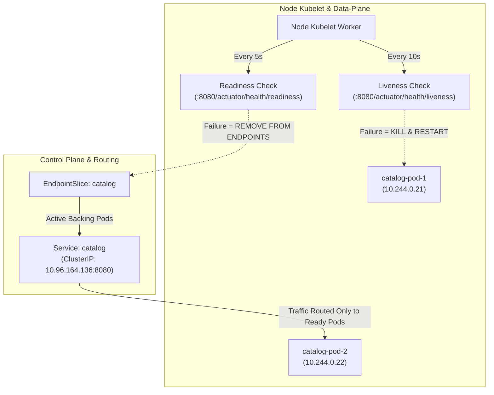
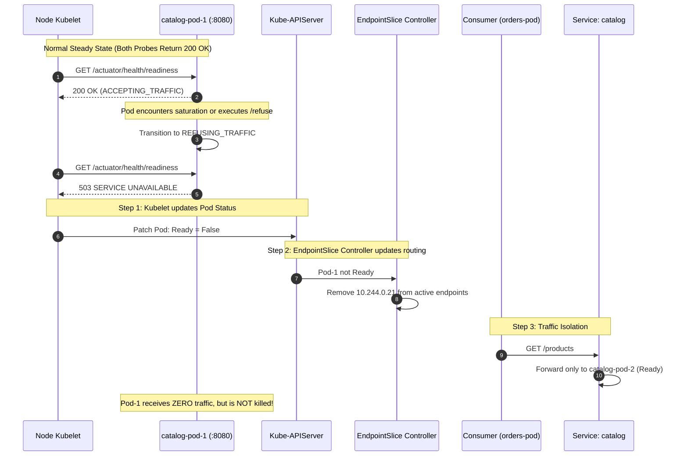
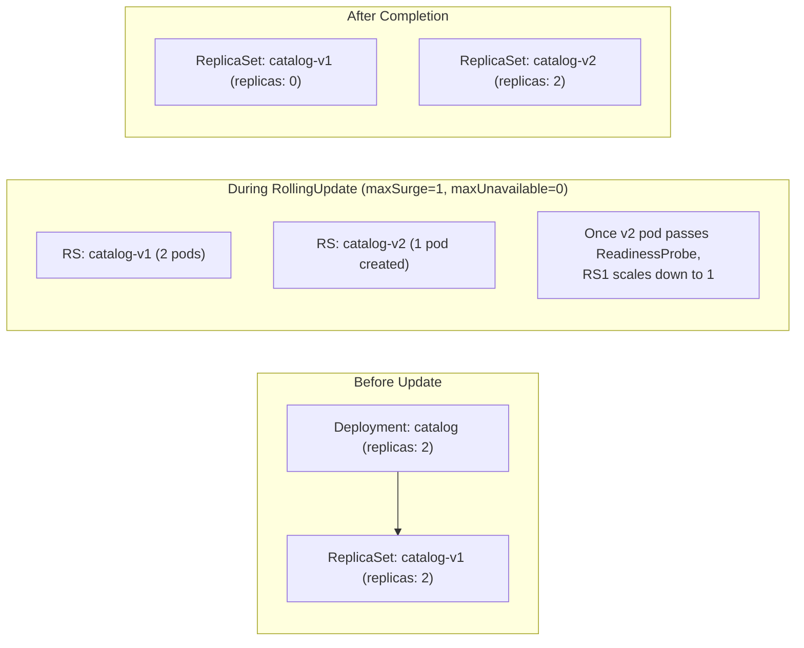

# Playbook 06: Operations (Probes, Jobs, & Rolling Updates)

## Architect's Concept

In monolithic, bare-metal operations, server health was binary: the machine was either online or offline. Deployments were high-stress events involving planned maintenance windows, DNS cutovers, and late-night pager duty.

Cloud-native systems flip this model. Hardware and processes are assumed to be **ephemeral and fallible**. A container might start up slowly, enter an in-process deadlock, or experience temporary saturation. To operate reliably at scale, Kubernetes relies on declarative operational controllers:

1. **Decoupled Health Contracts (Probes):**
   - **Liveness:** *"Is the process deadlocked or corrupted beyond repair?"* If yes, the `kubelet` terminates and restarts the container.
   - **Readiness:** *"Is the process currently capable of processing customer traffic?"* If no, the `kubelet` removes the Pod's IP from the Service's `EndpointSlice`. The container is **not killed**; it is temporarily quarantined from traffic until it recovers.
   - **Startup:** *"Has a slow-starting application (like a large JVM enterprise app) completed its initialization?"* It disables liveness and readiness checks until the process finishes booting, preventing premature restart loops.

2. **Run-to-Completion Workloads (Jobs):**
   Not all workloads run forever as long-lived HTTP daemons. Database migrations, data seeding, and one-off batch scripts must run **exactly once to completion**. Running schema migrations in microservice startup scripts causes race conditions when scaling to multiple replicas. A Kubernetes `Job` runs a Pod until the exit code is `0` (`Completed`), preserving logs for post-mortem audits.

3. **Zero-Downtime Rolling Updates & Instant Rollbacks:**
   A Deployment does not update Pods in-place. Instead, it coordinates two `ReplicaSets` simultaneously. By balancing `maxSurge` (how many extra pods can be created) and `maxUnavailable` (how many pods can be taken down), Kubernetes achieves zero-downtime updates. Crucially, **zero downtime is maintained by the Readiness Probe**: old Pods are only terminated after new Pods pass their readiness checks.



*Architectural Principle:* Never conflate vitality with capability. Liveness failures destroy the process. Readiness failures preserve the process and isolate it from consumer traffic.



---

## 🧭 Deep Dives: Concepts You Must Know

### 1. The Anatomy of Kubernetes Probes

A probe is a diagnostic performed periodically by the `kubelet` on a container.

| Probe Type | What It Answers | Trigger Condition | Action on Failure |
|---|---|---|---|
| **`startupProbe`** | *"Has the app booted?"* | Container start | Disables liveness/readiness until success. Kills container if `failureThreshold * periodSeconds` expires. |
| **`readinessProbe`** | *"Can it handle requests?"* | Continuous after startup | Strips Pod IP from `EndpointSlice`. Traffic stops reaching the pod. **Zero pod restarts.** |
| **`livenessProbe`** | *"Is the process deadlocked?"* | Continuous after startup | Kubelet terminates container and restarts it according to `restartPolicy`. |

#### Probe Execution Mechanisms
1. **`httpGet`:** Issues an HTTP GET request. Any status code $\ge 200$ and $< 400$ indicates success.
2. **`tcpSocket`:** Attempts to open a TCP connection to the container port. Used for non-HTTP services.
3. **`exec`:** Executes a command inside the container. Exit code `0` is healthy; non-zero is failure.
4. **`grpc`:** Sends a standard gRPC health check request.

#### The Spring Boot Actuator Architecture
Spring Boot Actuator integrates natively with Kubernetes probes:
- `/actuator/health/liveness`: Checks `LivenessState` (`CORRECT` vs `BROKEN`). Returns HTTP 200 or 503.
- `/actuator/health/readiness`: Checks `ReadinessState` (`ACCEPTING_TRAFFIC` vs `REFUSING_TRAFFIC`) and external dependencies like `DataSource`.
- `/actuator/health`: Aggregated health endpoint.

> **Production Warning:** NEVER point a `livenessProbe` to `/actuator/health` if it checks an external database. If PostgreSQL experiences a temporary network hiccup or query lock, your database health check fails. If your liveness probe checks this, Kubernetes will restart all your catalog pods simultaneously, triggering a **cascading outage**! Database and dependency checks belong strictly in the `readinessProbe`.

---

### 2. Batch Workloads with Kubernetes Jobs

A `Deployment` ensures a set of Pods are running perpetually. If a Pod exits with code `0`, a Deployment considers that an anomaly and restarts it!

A `Job` creates one or more Pods and ensures that a specified number of them successfully terminate with exit code `0`.

```text
Deployment: Desired state = Always Running (Web APIs, Daemons)
Job:        Desired state = Successfully Completed (Migrations, Seed, Cleanup)
```

#### Key Job Specifications:
- `restartPolicy: OnFailure`: If the container crashes (exit code $\neq 0$), kubelet restarts the container inside the *same* Pod.
- `restartPolicy: Never`: If the container crashes, the Pod is marked failed and the Job controller schedules a *brand new* Pod.
- `backoffLimit: 3`: Number of retry attempts before the Job controller gives up and marks the Job `Failed`.
- Pod Preservation: When a Job finishes, its Pod is **not deleted**. It enters the `Completed` state. This is an intentional Kubernetes design decision allowing engineers to run `kubectl logs` and inspect stdout/stderr after completion.

---

### 3. Zero-Downtime Rolling Updates & Rollback Mechanics

When you update a Deployment's container image (`kubectl set image`), the Deployment Controller initiates a phased rollout using two `ReplicaSets`:



#### The Surge and Unavailable Algorithm
Under `spec.strategy.rollingUpdate`:
- `maxSurge`: Maximum number of Pods that can be scheduled *above* desired replicas. (Default: `25%`).
- `maxUnavailable`: Maximum number of Pods that can be unavailable during the update. (Default: `25%`).

```yaml
spec:
  strategy:
    type: RollingUpdate
    rollingUpdate:
      maxSurge: 1        # Can run up to 3 pods during rollout
      maxUnavailable: 0  # Never drop below 2 healthy pods (Zero Downtime)
```

#### Rollbacks Under the Hood
Kubernetes records revision history directly in the ReplicaSet annotations:
```bash
kubectl rollout history deployment/catalog -n shop
kubectl rollout undo deployment/catalog -n shop --to-revision=1
```
`kubectl rollout undo` does not build old code or rewrite your manifest files. It simply instructs the Deployment controller to swap the target `spec.template` back to the replica set configuration corresponding to the selected revision!

---

## 🛠️ Step-by-Step Hands-on Instructions

### Step 1: Inspect the Updated Deployment Manifest

Inspect `k8s/raw/01-catalog-deployment.yaml` to observe the probe configurations:

```yaml
        livenessProbe:
          httpGet:
            path: /actuator/health/liveness
            port: 8080
          initialDelaySeconds: 20
          periodSeconds: 10
          timeoutSeconds: 2
          failureThreshold: 3
        readinessProbe:
          httpGet:
            path: /actuator/health/readiness
            port: 8080
          initialDelaySeconds: 15
          periodSeconds: 5
          timeoutSeconds: 2
          failureThreshold: 2
```

Apply the updated Deployment:

```bash
kubectl apply -f k8s/raw/01-catalog-deployment.yaml
kubectl rollout status deployment/catalog -n shop
```

---

### Step 2: Run the Database Seed Job

Inspect `k8s/raw/06-seed-job.yaml`. The job connects to `postgres:5432` using `catalog-secret` credentials and executes an idempotent SQL script.

Apply the Job:

```bash
# 1. Apply the database seed job
kubectl apply -f k8s/raw/06-seed-job.yaml

# 2. Wait for the Job to complete
kubectl wait --for=condition=complete job/catalog-db-seed -n shop --timeout=60s

# 3. View the Job pods and status
kubectl get job,pods -l app=catalog-db-seed -n shop
```

**Expected Output:**
```text
NAME                     COMPLETIONS   DURATION   AGE
job.batch/catalog-db-seed   1/1           3s         10s

NAME                         READY   STATUS      RESTARTS   AGE
pod/catalog-db-seed-xxxx     0/1     Completed   0          10s
```

View the Job execution logs:
```bash
kubectl logs -l app=catalog-db-seed -n shop
```

---

### Step 3: Verify the Injected Data via Catalog API

Verify that the seed data is queryable via the Catalog microservice:

```bash
CATALOG_POD=$(kubectl get pods -n shop -l app=catalog -o jsonpath="{.items[0].metadata.name}")
kubectl exec -it $CATALOG_POD -n shop -- curl -s http://localhost:8080/products
```

**Expected JSON Response:**
```json
[
  {
    "id": 1,
    "name": "Kubernetes in Action",
    "price": 49.99,
    "description": "Comprehensive guide to Kubernetes architecture and primitives"
  },
  {
    "id": 2,
    "name": "Cloud Native Patterns",
    "price": 39.99,
    "description": "Designing resilient microservices in modern cloud infrastructure"
  },
  {
    "id": 3,
    "name": "Designing Data-Intensive Applications",
    "price": 54.99,
    "description": "The definitive guide to distributed data systems"
  }
]
```

---

### Step 4: The Critical Experiment — Force a Readiness Failure

Now perform the central architectural experiment: **prove that a readiness failure isolates traffic without killing the pod**.

```bash
# 1. Select the first catalog pod
TARGET_POD=$(kubectl get pods -n shop -l app=catalog -o jsonpath="{.items[0].metadata.name}")
echo "Targeting pod: $TARGET_POD"

# 2. Force the readiness state to REFUSING_TRAFFIC
kubectl exec -it $TARGET_POD -n shop -- curl -s -X POST http://localhost:8080/actuator/readiness/refuse

# 3. Wait 5-8 seconds for the kubelet probe period, then inspect pod status
kubectl get pods -n shop -l app=catalog
```

**What to Observe in Pod Status:**
```text
NAME                       READY   STATUS    RESTARTS   AGE
catalog-5594b59bfc-xxxxx   0/1     Running   0          5m
catalog-5594b59bfc-yyyyy   1/1     Running   0          5m
```
Notice:
- `READY` is **`0/1`**!
- `STATUS` is still **`Running`**!
- `RESTARTS` is **`0`**! The container was not restarted because the `livenessProbe` is still healthy.

Now inspect the Service Endpoints:
```bash
kubectl get endpoints catalog -n shop
```
**What to Observe:**
Only the **single healthy pod IP** is listed in the endpoint addresses! The unready pod was automatically removed.

Test traffic from the orders service:
```bash
ORDERS_POD=$(kubectl get pods -n shop -l app=orders -o jsonpath="{.items[0].metadata.name}")
kubectl exec -it $ORDERS_POD -n shop -- curl -s http://catalog:8080/products
```
The request succeeds with 100% availability because the Service routes traffic exclusively to the healthy replica.

#### Restore Readiness
Restore the target pod to ready state:
```bash
kubectl exec -it $TARGET_POD -n shop -- curl -s -X POST http://localhost:8080/actuator/readiness/accept

# Wait 5 seconds
kubectl get pods -n shop -l app=catalog
```
Both pods are back to `1/1 Ready` and the EndpointSlice is automatically restored.

---

### Step 5: Execute a Zero-Downtime Rolling Update

Now execute a rolling update to the `v2` image:

```bash
# 1. Trigger the rolling update
kubectl set image deployment/catalog catalog=shop/catalog:v2 -n shop

# 2. Watch the rolling update in real-time
kubectl rollout status deployment/catalog -n shop -w
```

Inspect the ReplicaSets:
```bash
kubectl get replicasets -l app=catalog -n shop
```
You will see the old ReplicaSet scaled down to `0` and the new ReplicaSet scaled up to `2`.

Inspect the rollout history:
```bash
kubectl rollout history deployment/catalog -n shop
```

---

### Step 6: Rollback to the Previous Revision

Simulate a production incident where `v2` needs to be reverted immediately:

```bash
# 1. Undo the rollout to revert to the previous revision
kubectl rollout undo deployment/catalog -n shop

# 2. Watch the rollback complete
kubectl rollout status deployment/catalog -n shop -w

# 3. Verify current running image
kubectl get deployment catalog -n shop -o jsonpath="{.spec.template.spec.containers[0].image}"
```

---

## 🛑 What Just Happened (The Systems Reality)

1. **Traffic Quarantine vs Death:** When readiness failed, the pod stayed alive to finish ongoing in-flight requests or complete internal recovery. Liveness is your last line of defense (deadlocks); readiness is your dynamic traffic gate.
2. **Zero-Downtime Orchestration:** During the rolling update, Kubernetes did not terminate the `v1` pods until the `v2` pods passed both their `initialDelaySeconds` and their HTTP `readinessProbe`. If the `v2` image had a broken readiness check, the rolling update would have halted automatically, leaving the healthy `v1` pods serving 100% of user traffic!
3. **Auditability in Jobs:** The seed Job completed and left its Pod in `Completed` status so administrators could audit the database migration results via standard log aggregation.

---

## 📋 Architect's Checklist

- [ ] Does every HTTP deployment define an explicit `readinessProbe` with reasonable `initialDelaySeconds` and `periodSeconds`?
- [ ] Are `livenessProbe` endpoints strictly decoupled from downstream databases or external APIs to avoid cascading death spirals?
- [ ] Do database migrations and schema seeds run as Kubernetes `Jobs` or `InitContainers`, rather than inside application process entrypoints?
- [ ] Are Job `restartPolicy` settings intentionally chosen (`OnFailure` vs `Never`) with a bounded `backoffLimit`?
- [ ] Does your Deployment configure `maxSurge` and `maxUnavailable` to maintain required SLA during deployments?

---

## 🔍 Self-Study & Real-World Gotchas

### 1. The Cascading Database Outage Death Spiral
A common architectural mistake is checking database connectivity inside the `livenessProbe`. If the database undergoes a 15-second failover, all application pods fail liveness simultaneously. The kubelet restarts all containers across the entire cluster. When the database comes back online, hundreds of microservice instances cold-boot simultaneously, overwhelming the database connection pool in a classic thundering herd.
*Fix:* Keep database checks in `readinessProbe` only. When the database slows down, traffic throttles; pods do not crash.

### 2. Slow JVM Boot & The `startupProbe` Solution
Spring Boot applications with hundreds of beans can take 45–90 seconds to initialize on resource-constrained nodes. If `initialDelaySeconds` is too short, the liveness probe kills the JVM before it finishes starting, entering a permanent crash loop. If `initialDelaySeconds` is too long, real deadlocks during steady-state take minutes to detect.
*Fix:* Use `startupProbe` with `failureThreshold: 30` and `periodSeconds: 3` (up to 90s grace period). Steady-state `livenessProbe` can then run with aggressive 5s periods.

---

## 🛟 Troubleshooting Guide

| Symptom | Probable Cause | Fix / Diagnosis |
|---|---|---|
| Pod in `CrashLoopBackOff` with restart count incrementing | `livenessProbe` failing or JVM crashing on startup | Run `kubectl describe pod <name> -n shop`. Check `Events` for `Liveness probe failed`. Increase `initialDelaySeconds`. |
| Pod stays in `0/1 Ready` (`Running` status) | `readinessProbe` failing (e.g. database unreachable or `/refuse` active) | Run `kubectl describe pod <name> -n shop`. Look for `Readiness probe failed: HTTP probe failed with statuscode: 503`. |
| Rolling update hangs indefinitely | New pods cannot become `Ready` due to probe failure or `ImagePullBackOff` | Inspect `kubectl rollout status deployment/catalog -n shop`. Use `kubectl describe deployment catalog -n shop` to diagnose. Run `kubectl rollout undo` to recover. |
| Seed Job stays in `Error` or `CrashLoopBackOff` | PostgreSQL authentication failure or network timeout | Inspect `kubectl logs -l app=catalog-db-seed -n shop`. Check password in `catalog-secret`. |
