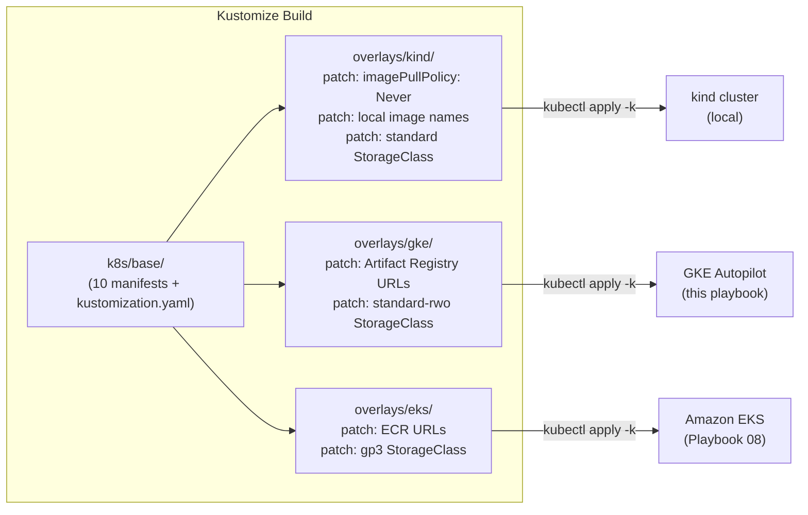
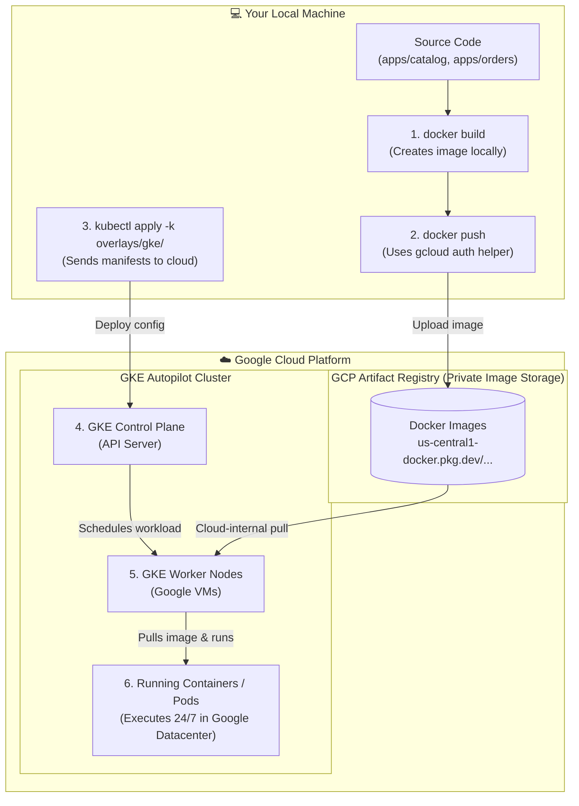

# Playbook 07: Kustomize & GKE Autopilot

## Architect's Concept

Every environment you deploy to — local `kind`, GKE, EKS, staging, production — shares the same Kubernetes API. Yet each environment has small but critical differences: image registry URLs differ, StorageClass names differ, resource limits might differ. Naively, you duplicate your YAML for each environment and pray the copies stay in sync. That always ends badly.

**Kustomize** solves this with a radically simple model: one **base** of complete, valid YAML that works anywhere in principle, plus thin **overlays** that apply targeted patches per environment. No templating engine. No variable substitution syntax to learn. Just plain YAML with surgical patches.

```
k8s/
├── base/               ← complete, environment-agnostic manifests
└── overlays/
    ├── kind/           ← patches: local image names, imagePullPolicy: Never
    ├── gke/            ← patches: Artifact Registry image URLs, standard-rwo StorageClass
    └── eks/            ← patches: ECR image URLs, gp3 StorageClass  (Playbook 08)
```

The payoff: `diff <(kubectl kustomize overlays/kind/) <(kubectl kustomize overlays/gke/)` shows you the **complete, exact list of differences** between your local and cloud environments. In this project, that diff is exactly two things:

1. **Image registry URL** — `shop/catalog:dev` → `<region>-docker.pkg.dev/<project>/shop/catalog:dev`
2. **StorageClass name** — `standard` (kind default) → `standard-rwo` (GKE Persistent Disk)

Everything else — Deployments, Services, ConfigMaps, Secrets, the seed Job, probes, replica counts — is **byte-for-byte identical** across all environments. This is the Kubernetes portability promise made concrete.



**Why GKE Autopilot?** Standard GKE requires you to manage node pools: choose instance types, sizes, autoscaling policies, and OS images. Autopilot removes all of that. You declare Pods with resource requests; GKE provisions exactly the compute needed and bills you per pod rather than per node. For a learning exercise running for 2–3 hours, this is the cheapest and most operationally honest way to experience managed Kubernetes.

---

## 🧭 Deep Dives: Concepts You Must Know

### 1. Kustomize Architecture

Kustomize is built into `kubectl`. No installation needed (`kubectl kustomize` or `kubectl apply -k`).

#### The `kustomization.yaml` file

Every Kustomize layer (base or overlay) has a `kustomization.yaml` that describes what it manages:

```yaml
# k8s/base/kustomization.yaml — the base layer
apiVersion: kustomize.config.k8s.io/v1beta1
kind: Kustomization

resources:           # List of plain YAML manifests to include
  - 01-catalog-deployment.yaml
  - 02-catalog-service.yaml
  # ...
```

```yaml
# k8s/overlays/gke/kustomization.yaml — an overlay layer
apiVersion: kustomize.config.k8s.io/v1beta1
kind: Kustomization

resources:
  - ../../base        # ← points to the base directory

images:              # ← rewrite image names in-place (no editing manifests!)
  - name: shop/catalog:dev
    newName: us-central1-docker.pkg.dev/k8s-learn-myname/shop/catalog
    newTag: dev
  - name: shop/orders:dev
    newName: us-central1-docker.pkg.dev/k8s-learn-myname/shop/orders
    newTag: dev

patches:             # ← apply strategic merge patches
  - path: patch-storageclass.yaml
```

#### Patch types

**Strategic Merge Patch** — you write a partial YAML fragment that is merged onto the base resource. Only the fields you specify are changed:
```yaml
# patch-storageclass.yaml
apiVersion: apps/v1
kind: StatefulSet
metadata:
  name: postgres
  namespace: shop
spec:
  volumeClaimTemplates:
  - metadata:
      name: postgres-data
    spec:
      storageClassName: standard-rwo   # overrides the base value
```

**JSON 6902 Patch** — surgical `add`, `replace`, `remove` operations by path. Useful for single-field changes.

#### The `images:` transformer (your most-used GKE/EKS tool)

The `images:` block in `kustomization.yaml` rewrites image references throughout all resources in that layer without touching the base YAML files. Kustomize finds every container and initContainer whose `image` matches `name:` and replaces it with `newName:newTag`. This is how switching clouds becomes a 5-line config change.

---

### 2. GCP Project Isolation Strategy

> **Why a dedicated project?** GCP billing, IAM, quotas, and resources are scoped to a project. Creating a new project for this exercise gives you a complete, isolated blast radius: one `gcloud projects delete` at the end removes the cluster, Artifact Registry, VPC, networking rules, billing linkage, and service accounts — permanently. Nothing from this exercise can accidentally affect other GCP workloads.

GCP project lifecycle:
- `gcloud projects create` → project exists, no billing
- Link billing account → APIs can be enabled, resources can be created
- `gcloud projects delete` → 30-day pending deletion window; **billing stops immediately**; project cannot create new resources
- After 30 days → permanently and irrecoverably deleted
- Can restore within 30 days: `gcloud projects undelete <project-id>`

---

### 3. GKE Autopilot vs Standard GKE

| Aspect | GKE Standard | GKE Autopilot |
|---|---|---|
| Node management | You manage node pools, sizes, OS | Google manages everything |
| Billing | Per node (EC2-like) | Per pod CPU/memory |
| Idle cost | Nodes cost money even with no pods | No pods → no charges |
| `kubectl get nodes` | Shows your nodes | Shows ephemeral "virtual" nodes |
| Resource requests | Optional (but recommended) | **Mandatory** — Autopilot uses them to provision |
| Best for | Fine-grained node control | Learning, staging, variable workloads |

> **Important for our manifests:** All our Deployments already declare `resources.requests` (from Playbook 04). GKE Autopilot will accept them as-is.

---

### 4. Artifact Registry vs Docker Hub

GCP's **Artifact Registry** is the successor to Container Registry (GCR). It supports Docker images, is regionally co-located with GKE (fast pull, no egress cost within the same region), and integrates with GKE's default service accounts so the cluster can pull without manual imagePullSecrets.

#### The Build-Push-Run Flow



> 💡 **Where does the container actually run?**
> The container runs **100% inside Google Cloud (on GKE)**, not on your laptop. Your laptop's only job is to compile the source code into an image (`docker build`) and upload it (`docker push`). After that, your laptop is no longer involved in running the application.

---

## 🛠️ Step-by-Step Hands-on Instructions

> **Prerequisites:** `gcloud` CLI installed. `docker` installed. `kubectl` installed. Your `kind` cluster (from earlier playbooks) is irrelevant for this playbook — we are provisioning a fresh cloud cluster.

---

### Step 1: Install and Initialise `gcloud`

If you do not have the Google Cloud CLI:

```bash
# macOS via Homebrew
brew install --cask google-cloud-sdk

# Verify
gcloud version
```

Authenticate and set defaults:

```bash
# Opens browser for OAuth login
gcloud auth login

# Also authenticate the docker credential helper
gcloud auth application-default login
```

---

### Step 2: Create a Dedicated GCP Project

```bash
# Choose a globally unique project ID (lowercase letters, digits, hyphens; max 30 chars)
export PROJECT_ID="k8s-learn-$(whoami | tr '[:upper:]' '[:lower:]' | head -c 10)"
export REGION="us-central1"

echo "Project ID: $PROJECT_ID"

# Create the project
gcloud projects create $PROJECT_ID --name="K8s Learning"

# Set it as the active project for all subsequent commands
gcloud config set project $PROJECT_ID
```

**Via Console (alternative):**
1. Go to [console.cloud.google.com](https://console.cloud.google.com)
2. Click the project dropdown (top-left, next to the Google Cloud logo) → **New Project**
3. Enter a project name (`K8s Learning`) and note the auto-generated **Project ID** — copy it
4. Click **Create**
5. After creation, select the new project from the dropdown to make it active

**Verify:**
```bash
gcloud projects describe $PROJECT_ID
```
Expected: `lifecycleState: ACTIVE`

---

### Step 3: Link Billing & Enable APIs

> GCP projects require an active billing account before they can create compute resources. Without billing, cluster creation fails.

```bash
# List your billing accounts
gcloud billing accounts list

# Copy the ACCOUNT_ID from the output (format: XXXXXX-XXXXXX-XXXXXX)
export BILLING_ACCOUNT="REPLACE_WITH_YOUR_BILLING_ACCOUNT_ID"

# Link billing to the project
gcloud billing projects link $PROJECT_ID --billing-account=$BILLING_ACCOUNT

# Enable the APIs required for GKE and Artifact Registry
gcloud services enable \
  container.googleapis.com \
  artifactregistry.googleapis.com \
  --project=$PROJECT_ID
```

**Via Console (alternative):**
1. **Link billing:** Go to **Billing** in the console → **My Projects** → find your project → click the three-dot menu → **Change billing** → select your billing account
2. **Enable APIs:** Go to **APIs & Services → Enable APIs and Services** → search for and enable:
   - `Kubernetes Engine API`
   - `Artifact Registry API`

**Verify:**
```bash
gcloud services list --enabled --project=$PROJECT_ID | grep -E "container|artifact"
```

---

### Step 4: Set Up a Budget Alert ($5 Safety Net)

> Do this before creating any resources. A budget alert emails you if spending exceeds a threshold, preventing surprise charges.

```bash
# Create a $5/month budget alert via CLI
gcloud billing budgets create \
  --billing-account=$BILLING_ACCOUNT \
  --display-name="k8s-learn budget" \
  --budget-amount=5USD \
  --threshold-rule=percent=100 \
  --threshold-rule=percent=50
```

**Via Console (alternative):**
1. Go to **Billing → Budgets & alerts → Create budget**
2. **Scope:** Select your project (`k8s-learn-...`)
3. **Amount:** Set to `$5`, type = Specified amount
4. **Actions:** Keep the default email alert thresholds (50%, 90%, 100%) — make sure your email is listed
5. Click **Finish**

---

### Step 5: Create Artifact Registry Repository

```bash
gcloud artifacts repositories create shop \
  --repository-format=docker \
  --location=$REGION \
  --description="k8s-learn shop images" \
  --project=$PROJECT_ID
```

**Via Console (alternative):**
1. Go to **Artifact Registry → Repositories → Create Repository**
2. **Name:** `shop`
3. **Format:** Docker
4. **Location type:** Region → select `us-central1` (or your chosen region)
5. Click **Create**

Configure your local Docker daemon to authenticate with Google Artifact Registry:

```bash
gcloud auth configure-docker ${REGION}-docker.pkg.dev
```

> ❓ **Why do you need Docker configuration if the container runs on GKE?**
> Even though GKE *runs* the container, your **laptop** is the machine that *builds* the image and *uploads* (`docker push`) it to Google's cloud storage (Artifact Registry).
> By default, your local `docker` command has no idea who you are or whether you own that GCP project. `gcloud auth configure-docker` writes Google's credential helper into your local `~/.docker/config.json`. This grants your local `docker push` command permission to upload image files into your GCP Artifact Registry repository.

**Verify:**
```bash
gcloud artifacts repositories list --location=$REGION --project=$PROJECT_ID
```

---

### Step 6: Build and Push Images to Artifact Registry

> We are building the same application images as before, but tagging them with the Artifact Registry path instead of the local `shop/` prefix.

```bash
# Set the full registry prefix
export REGISTRY="${REGION}-docker.pkg.dev/${PROJECT_ID}/shop"

# Build and push catalog
docker build -t ${REGISTRY}/catalog:dev apps/catalog/
docker push ${REGISTRY}/catalog:dev

# Build and push orders
docker build -t ${REGISTRY}/orders:dev apps/orders/
docker push ${REGISTRY}/orders:dev
```

**Verify:**
```bash
gcloud artifacts docker images list ${REGION}-docker.pkg.dev/${PROJECT_ID}/shop --project=$PROJECT_ID
```
You should see two images: `catalog` and `orders`, each with tag `dev`.

---

### Step 7: Provision the GKE Autopilot Cluster

```bash
gcloud container clusters create-auto k8s-learn \
  --region=$REGION \
  --project=$PROJECT_ID
```

> This command takes 3–5 minutes. Autopilot provisions the control plane and configures networking. No node pool decisions are required.

**Via Console (alternative):**
1. Go to **Kubernetes Engine → Clusters → Create**
2. Choose **Autopilot** mode (not Standard)
3. **Cluster name:** `k8s-learn`
4. **Region:** `us-central1` (or your chosen region)
5. Leave all other settings as default → Click **Create**
6. Wait for the green checkmark (~3–5 min), then click **Connect** to get the `gcloud get-credentials` command

Configure `kubectl` to point to the new cluster:

```bash
gcloud container clusters get-credentials k8s-learn \
  --region=$REGION \
  --project=$PROJECT_ID
```

**Verify the context:**
```bash
kubectl config current-context
# Expected: gke_<project-id>_<region>_k8s-learn

kubectl get nodes
# GKE Autopilot shows a minimal node count; nodes are provisioned on-demand per Pod
```

Create the `shop` namespace (same as on kind):
```bash
kubectl create namespace shop
```

---

### Step 8: Build the Kustomize Base (`k8s/base/`)

> The base is a faithful copy of `k8s/raw/` — no changes, just organised for Kustomize.

```bash
mkdir -p k8s/base

# Copy all raw manifests into base (raw/ stays untouched)
cp k8s/raw/*.yaml k8s/base/
```

Create `k8s/base/kustomization.yaml`:

```yaml
apiVersion: kustomize.config.k8s.io/v1beta1
kind: Kustomization

namespace: shop

resources:
  - 01-catalog-deployment.yaml
  - 02-catalog-service.yaml
  - 02-catalog-nodeport.yaml
  - 03-postgres-statefulset.yaml
  - 03-postgres-service.yaml
  - 04-catalog-configmap.yaml
  - 04-catalog-secret.yaml
  - 05-orders-deployment.yaml
  - 05-orders-service.yaml
  - 06-seed-job.yaml
```

**Verify the base renders valid YAML:**
```bash
kubectl kustomize k8s/base/
```
The output should be identical to concatenating all your raw manifests.

---

### Step 9: Create the `kind` Overlay

```bash
mkdir -p k8s/overlays/kind
```

`k8s/overlays/kind/kustomization.yaml`:
```yaml
apiVersion: kustomize.config.k8s.io/v1beta1
kind: Kustomization

resources:
  - ../../base

# For kind: images are loaded locally, never pulled from a registry
patches:
  - path: patch-imagepullpolicy.yaml
  - path: patch-storageclass.yaml
```

`k8s/overlays/kind/patch-imagepullpolicy.yaml`:
```yaml
# Patches both catalog and orders to imagePullPolicy: Never
# (images are local; kind cannot pull from a registry)
apiVersion: apps/v1
kind: Deployment
metadata:
  name: catalog
  namespace: shop
spec:
  template:
    spec:
      containers:
      - name: catalog
        imagePullPolicy: Never
---
apiVersion: apps/v1
kind: Deployment
metadata:
  name: orders
  namespace: shop
spec:
  template:
    spec:
      containers:
      - name: orders
        imagePullPolicy: Never
```

`k8s/overlays/kind/patch-storageclass.yaml`:
```yaml
# kind uses the 'standard' StorageClass (rancher.io/local-path provisioner)
# No patch needed — base manifests have no storageClassName, so kind's default is used
# This file is a placeholder to make the overlay structure explicit
apiVersion: apps/v1
kind: StatefulSet
metadata:
  name: postgres
  namespace: shop
spec:
  volumeClaimTemplates:
  - metadata:
      name: postgres-data
    spec:
      storageClassName: standard
```

---

### Step 10: Create the GKE Overlay

```bash
mkdir -p k8s/overlays/gke
```

`k8s/overlays/gke/kustomization.yaml`:
```yaml
apiVersion: kustomize.config.k8s.io/v1beta1
kind: Kustomization

resources:
  - ../../base

# Rewrite local image names to Artifact Registry paths
# Replace REGION and PROJECT_ID with your actual values
images:
  - name: shop/catalog:dev
    newName: us-central1-docker.pkg.dev/YOUR_PROJECT_ID/shop/catalog
    newTag: dev
  - name: shop/orders:dev
    newName: us-central1-docker.pkg.dev/YOUR_PROJECT_ID/shop/orders
    newTag: dev

patches:
  - path: patch-storageclass.yaml
```

> Replace `YOUR_PROJECT_ID` with your actual `$PROJECT_ID` value. In a real project, you would use a pipeline variable or `envsubst`.

`k8s/overlays/gke/patch-storageclass.yaml`:
```yaml
# GKE Autopilot uses 'standard-rwo' (Google Compute Engine Persistent Disk, ReadWriteOnce)
# This replaces the base StatefulSet's volumeClaimTemplate storageClassName
apiVersion: apps/v1
kind: StatefulSet
metadata:
  name: postgres
  namespace: shop
spec:
  volumeClaimTemplates:
  - metadata:
      name: postgres-data
    spec:
      storageClassName: standard-rwo
```

**Verify the GKE overlay renders valid YAML:**
```bash
kubectl kustomize k8s/overlays/gke/
```

---

### Step 11: See the Diff — The Learning Payoff

```bash
diff \
  <(kubectl kustomize k8s/overlays/kind/) \
  <(kubectl kustomize k8s/overlays/gke/)
```

**What you will see — and only this:**

```diff
<       image: shop/catalog:dev
>       image: us-central1-docker.pkg.dev/YOUR_PROJECT_ID/shop/catalog:dev

<       image: shop/orders:dev
>       image: us-central1-docker.pkg.dev/YOUR_PROJECT_ID/shop/orders:dev

<       imagePullPolicy: Never
>       imagePullPolicy: IfNotPresent

<       storageClassName: standard
>       storageClassName: standard-rwo
```

That is the **complete, exhaustive list of differences** between your local and cloud Kubernetes environments for this application. Everything else is identical. This is what Kustomize makes explicit and enforces structurally.

---

### Step 12: Deploy to GKE Autopilot

```bash
# Deploy using the GKE overlay
kubectl apply -k k8s/overlays/gke/

# Watch pods come up (Autopilot may take 1-2 minutes to provision nodes for the first time)
kubectl get pods -n shop -w
```

**Expected output when stable:**
```text
NAME                       READY   STATUS      RESTARTS   AGE
catalog-xxxxxxxxxx-xxxxx   1/1     Running     0          3m
catalog-xxxxxxxxxx-yyyyy   1/1     Running     0          3m
orders-xxxxxxxxxx-zzzzz    1/1     Running     0          2m
postgres-0                 1/1     Running     0          3m
catalog-db-seed-xxxxx      0/1     Completed   0          2m
```

> GKE Autopilot may show a `Pending` state for 60–90 seconds while it provisions a node. This is expected.

---

### Step 13: Verify End-to-End on GKE

```bash
# 1. Verify catalog API
CATALOG_POD=$(kubectl get pods -n shop -l app=catalog -o jsonpath="{.items[0].metadata.name}")
kubectl exec -it $CATALOG_POD -n shop -- curl -s http://localhost:8080/products

# 2. Verify orders → catalog communication
ORDERS_POD=$(kubectl get pods -n shop -l app=orders -o jsonpath="{.items[0].metadata.name}")
kubectl exec -it $ORDERS_POD -n shop -- curl -s http://catalog:8080/products

# 3. Verify the full data flow: orders → catalog → postgres
kubectl exec -it $ORDERS_POD -n shop -- curl -s http://localhost:8083/orders

# 4. Check nodes Autopilot provisioned
kubectl get nodes
```

**What to Observe:**
- `kubectl get nodes` shows nodes that appeared automatically. You never specified instance types or counts.
- The same `kubectl apply -k` command worked identically on `kind` and GKE. The application code is unchanged.
- GKE Autopilot provisions exactly the compute requested by your Pod `resources.requests`, nothing more.

---

## 🛑 What Just Happened (The Systems Reality)

1. **Kustomize Base vs. Overlay:** The base is a contract — valid Kubernetes YAML that describes your application structure. Overlays are narrow, explicitly named exceptions to that contract. The exceptions are small because Kubernetes is designed to be cloud-agnostic at the manifest level.

2. **GKE Autopilot Node Provisioning:** When you ran `kubectl apply -k`, the Autopilot control plane read the `resources.requests` from your Deployments and StatefulSet and provisioned exactly the compute needed. Run `kubectl get nodes` and then `kubectl describe node <name>` — you will see nodes named `gk3-k8s-learn-*` with capacity that matches your aggregate pod requests.

3. **`imagePullPolicy` shift:** On `kind`, images were loaded locally and `Never` was required. On GKE, the cluster pulls from Artifact Registry over an internal GCP network (no egress cost). `IfNotPresent` is now the right policy — if the node already cached the image, it skips the pull.

4. **StorageClass difference:** `standard` on `kind` uses the `rancher.io/local-path` provisioner, creating directories inside the Docker container running the control-plane node. `standard-rwo` on GKE uses `pd.csi.storage.gke.io`, provisioning a durable Google Compute Engine Persistent Disk that persists independently of the node. Your Postgres data is now on real cloud storage.

---

## 📋 Architect's Checklist

- [ ] Does your `k8s/base/` contain no environment-specific values (no image registry URLs, no cloud-specific StorageClass names)?
- [ ] Does each overlay patch only what genuinely differs in that environment?
- [ ] Does `diff <(kubectl kustomize overlays/kind/) <(kubectl kustomize overlays/gke/)` show only the expected differences?
- [ ] Are images pushed to Artifact Registry in the same region as the GKE cluster? (Cross-region pulls incur egress costs)
- [ ] Did you set up a budget alert before provisioning the cluster?

---

## 🔍 Self-Study & Real-World Gotchas

### 1. Autopilot Pod Eviction for Missing Resource Requests
GKE Autopilot **rejects** pods that do not declare `resources.requests`. Our manifests already have them (from Playbook 04). In a team setting, enforce this via a `LimitRange` or an admission webhook — do not rely on developers remembering.

### 2. `imagePullPolicy: Never` on a Cloud Cluster
If you accidentally apply the `kind` overlay to a cloud cluster, every pod will fail with `ErrImageNeverPull`. This is actually useful: Kustomize's overlay model makes this class of mistake explicit and recoverable. Always verify which context `kubectl` is pointed at before applying: `kubectl config current-context`.

### 3. Artifact Registry Pull Auth
GKE uses Workload Identity Federation to pull from Artifact Registry in the same project automatically. If you push to a *different* project's registry, you need to configure `imagePullSecrets`. Keep registry and cluster in the same project to avoid this complexity.

### 4. Postgres PVC and `standard-rwo`
`ReadWriteOnce` means the volume can only be mounted by **one node at a time**. For a single-replica StatefulSet (as in this project), this is correct. If you ever scale Postgres to multiple replicas (e.g., a read replica), you need a different storage solution (Cloud SQL, AlloyDB, or a distributed storage system).

---

## 🛟 Troubleshooting Guide

| Symptom | Probable Cause | Fix |
|---|---|---|
| Pod stuck `Pending` on GKE for > 5 min | Autopilot quota not available in region, or resource request too large | `kubectl describe pod <name> -n shop` → check Events for quota messages. Try a different region. |
| `ImagePullBackOff` on GKE | Image not pushed to Artifact Registry, or wrong registry URL in overlay | `kubectl describe pod <name> -n shop` → check image URL in Events. Verify `docker push` succeeded. |
| PVC stuck `Pending` | Wrong StorageClass name | `kubectl get pvc -n shop`. Check `storageClassName` in GKE overlay. On GKE Autopilot, use `standard-rwo`. |
| `kubectl apply -k` fails with "unknown field" | Patch target does not match base resource name/namespace | Check that `metadata.name` and `metadata.namespace` in the patch match the base resource exactly. |
| Cannot push to Artifact Registry | `gcloud auth configure-docker` not run, or wrong region | Re-run `gcloud auth configure-docker ${REGION}-docker.pkg.dev`. Check the registry URL prefix matches the region. |

---

## 🧹 Mandatory Cleanup — Stop All Charges

> Run this section when you have finished the GKE exercises. Do not skip it.

### Option A: Delete the entire GCP project (recommended)

```bash
gcloud projects delete $PROJECT_ID
```

**What this does:**
- Immediately stops all billing for the project
- Terminates the GKE cluster, nodes, and all pods
- Schedules the project for permanent deletion after 30 days
- You can restore within 30 days: `gcloud projects undelete $PROJECT_ID`

**Verify the deletion was accepted:**
```bash
gcloud projects describe $PROJECT_ID
# lifecycleState: DELETE_REQUESTED  ← charges stopped
```

### Option B: Delete only the cluster (keep the project)

Use this if you want to keep the Artifact Registry images for comparison later:

```bash
# Delete the cluster (stops all compute charges)
gcloud container clusters delete k8s-learn --region=$REGION --project=$PROJECT_ID

# Optionally delete images too (tiny storage cost, ~$0.10/GB/month)
gcloud artifacts repositories delete shop --location=$REGION --project=$PROJECT_ID
```

### After Cleanup — Verify Zero Charges

Navigate to **GCP Console → Billing → Cost breakdown** and confirm no active resources remain. Alternatively:

```bash
# Confirm no clusters running
gcloud container clusters list --project=$PROJECT_ID

# Confirm no Artifact Registry repositories
gcloud artifacts repositories list --location=$REGION --project=$PROJECT_ID
```

---

## Next Step

With GKE complete, you have proven that the Kustomize overlay model works. In **Playbook 08**, you will deploy the same application to **Amazon EKS** by:
1. Creating a stub `k8s/overlays/eks/` overlay (replacing only image URLs and StorageClass name)
2. Running `diff <(kubectl kustomize overlays/gke/) <(kubectl kustomize overlays/eks/)` to see the cloud-to-cloud differences
3. Executing on real AWS infrastructure with `eksctl`

The manifests will not change. Only the overlay values change. That is the point.
